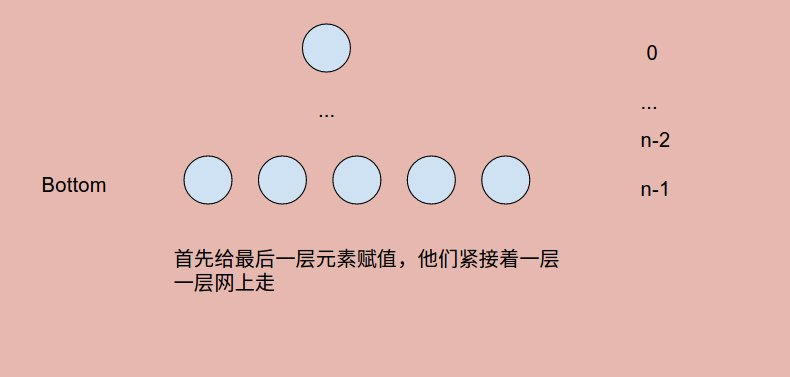

# Problem120: Triangle


> https://leetcode.com/problems/triangle/

-------------------------------
##思路：
这道题是一道经典问题，对于理解 dp 问题非常好。一个直观的想法就是从下往上层层构建，最后到达结果。



-----------------
```java
public class Solution {
    public int minimumTotal(List<List<Integer>> triangle) {
        if (triangle == null || triangle.size() == 0) {
            return -1;
        }
        //state: dp[x][y] = minimum path value from x, y to bottom
        int n = triangle.size();
        int[][] dp = new int[n][n];
        
        //initiate
        for (int j = 0; j < n; j++) {
            dp[n - 1][j] = triangle.get(n - 1).get(j);
        }
        
        //bottom up
        for (int i = n - 2; i >= 0; i--) {
            for (int j = 0; j <= i; j++) {
                dp[i][j] = Math.min(dp[i + 1][j], dp[i + 1][j + 1]) + triangle.get(i).get(j);
            }
        }
        //answer
        return dp[0][0];
    }
}
```
----------------
##易错点
1. 给定的input类型
   ```java
   List<List<Integer>> triangle
   ```
   通常我们遇到的都是一个二维数组```int[][] triangle```， 调用的时候只要```triangle[i][j]```就好，但是遇到list的嵌套，我们访问元素的时候，可以 ```triangle.get(i).get(j)``` 。同样的内容，不同的方法。

2. adjacent number
   ```dp[i + 1][j], dp[i + 1][j + 1]```就是三角形当中的相邻元素
3. 循环体
   ```java
   for (int i = n - 2; i >= 0; i--) {
            for (int j = 0; j <= i; j++) {
                dp[i][j] = Math.min(dp[i + 1][j], dp[i + 1][j + 1]) + triangle.get(i).get(j);
            }
   }
   ```
   注意这两层循环的嵌套。外面一层循环，控制从bottom一层逐渐往上走;里面的一层，控制着每一层的逐行扫描，由左到右。


