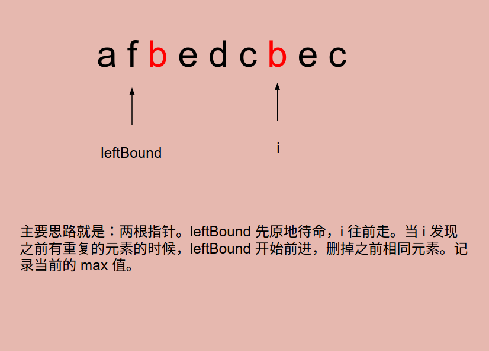

# Problem3: Longest Substring Without Repeating Characters


> https://leetcode.com/problems/longest-substring-without-repeating-characters/

----------------
##思路



------
```java
public class Solution {
    public int lengthOfLongestSubstring(String s) {
        if (s == null || s.length() == 0) {
            return 0;
        }
        
        HashSet<Character> set = new HashSet<Character>();
        int leftBound = 0;
        int max = 0;
        for (int i = 0; i < s.length(); i++) {
            if (set.contains(s.charAt(i))) {
                while (leftBound < i && s.charAt(leftBound) != s.charAt(i)) {
                    set.remove(s.charAt(leftBound));
                    leftBound++;
                }
                leftBound++;
            } else {
                set.add(s.charAt(i));
                max = Math.max(max, i - leftBound + 1);
            } 
        }
        
        return max;
    }
}
```
------
##易错点
1. 最大长度记得加 1
```java
max = Math.max(max, i - leftBound + 1);
```
2. 删掉之前的元素之后，leftBound 继续左移
```java
if (set.contains(s.charAt(i))) {
            while (leftBound < i && s.charAt(leftBound) != s.charAt(i)) {
                   set.remove(s.charAt(leftBound));
                   leftBound++;
            }
            leftBound++;
```


