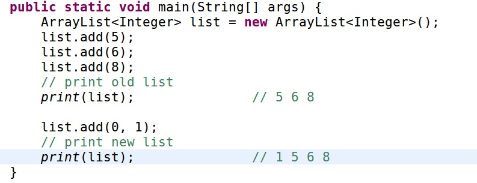

# Problem 118: Pascal's Triangle

>https://leetcode.com/problems/pascals-triangle/

--------
##思路

* 首先这是杨辉三角形的一个生成
* 每次先把每行第一个 ‘1’ 打印出来，然后后面的元素就是上一行的两个元素的和
* 对于最后一个 ‘1’， 因为上一行比下一行少一个元素，所以对于本行的最后一个元素来说，就是上一行的最后一个元素加上一个 “空元素”，所以还是 ‘1’

-------------
```java
public class Solution {
    public List<List<Integer>> generate(int numRows) {
        List<Integer> rowRes = new ArrayList<Integer>();
        List<List<Integer>> res = new ArrayList(rowRes);  
        if (numRows == 0) {
            return res;
        }
        
        for (int i = 0; i < numRows; i++) {
            rowRes.add(0, 1);
            for (int j = 1; j < rowRes.size() - 1; j++) {
                rowRes.set(j, rowRes.get(j) + rowRes.get(j + 1));
            }
            res.add(new ArrayList(rowRes));
        }
        
        return res;
    }
}
```
-----
##易错点
1. ArrayList  的 add() 方法
```java
rowRes.add(0, 1);
```
这里的意思是，在 index 为 0 的地方，赋值为 1
2. ArrayList 加了元素以后，后面的元素自动顺延，而不是替代

3. 上一个问题也恰巧解释了 set 方法中的 index 问题： 因为添加元素后，之前的元素顺延了，index 也发生了改变
```java
rowRes.set(j, rowRes.get(j) + rowRes.get(j + 1));
```


