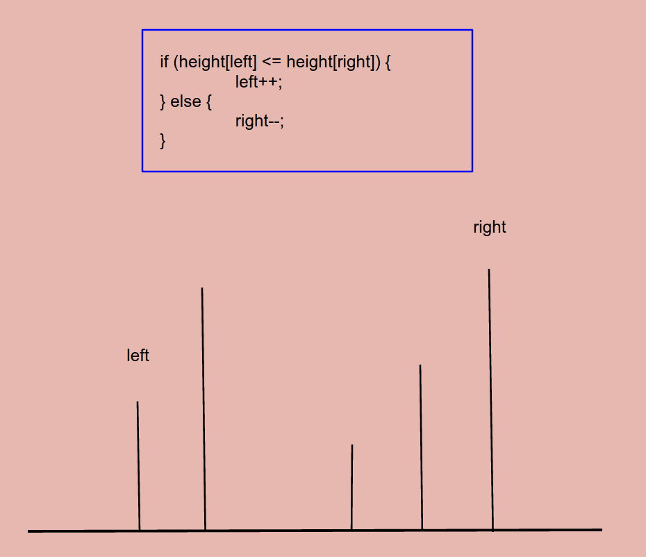

# Problem 11: Container With Most Water


> https://leetcode.com/problems/container-with-most-water/

--------
##思路


------------
```java
public class Solution {
    public int maxArea(int[] height) {
        int left = 0, right = height.length - 1;
        int max = 0;
        while (left <= right) {
            max = Math.max(max, getMaxArea(left, right, height));
            if (height[left] <= height[right]) {
                left++;
            } else {
                right--;
            }
         }
         
        return max;
    }
    
    private int getMaxArea(int left, int right, int[] height) {
        int max = (right - left) * Math.min(height[left], height[right]);
        return max;
    }
}
```
-----
##易错点

1. 什么时候求 max，什么时候求 min 要分清


