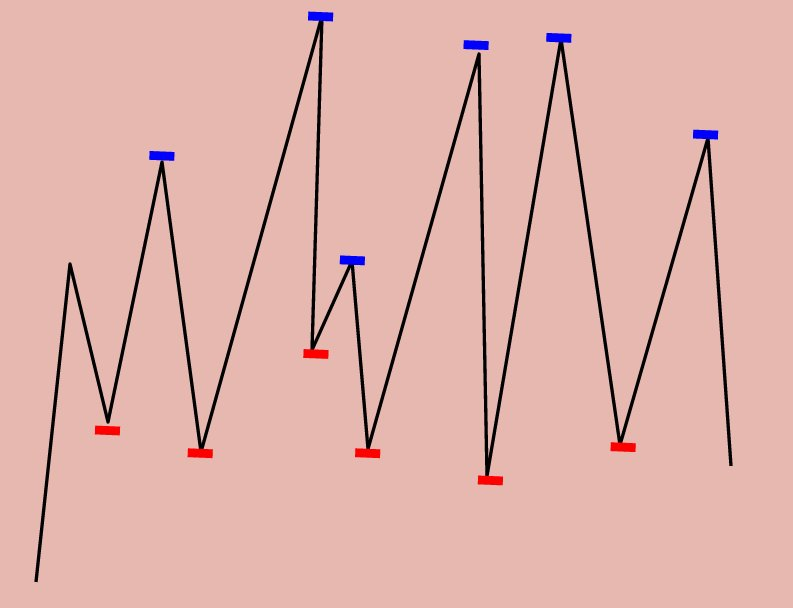

# Problem 122: Best Time to Buy and Sell Stock II


> https://leetcode.com/problems/best-time-to-buy-and-sell-stock-ii/

-------------
##思路
* 允许多次买入卖出，要想利益最大化，我们需要在每一个最低点买入，再在每一个最高点卖出

---------
```java
public class Solution {
    public int maxProfit(int[] prices) {
        if (prices == null || prices.length == 0) {
            return 0;
        }
        
        int profit = 0;
        for (int i = 0; i < prices.length - 1; i++) {
            int diff = prices[i + 1] - prices[i];
            if (diff > 0) {
                profit += diff;
            }
        }
        
        return profit;
    }
}
```
-----
##易错点
1. 数组中有```i + 1```存在的时候，必然考虑到 i 循环到 倒数第二个元素
```java
for (int i = 0; i < prices.length - 1; i++)
```

