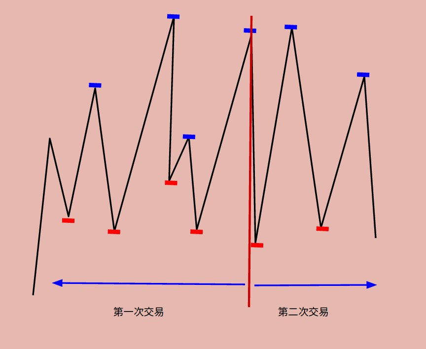

# Problem 123: Best Time to Buy and Sell Stock III

> https://leetcode.com/problems/best-time-to-buy-and-sell-stock-iii/

-----------------------
##思路
* 两次买卖，并且一个时间点只能进行一次交易（不能同时既买进又卖出），那么肯定存在一个时间点（并且是卖出点），在这之前进行的是第一次交易，在这之后进行的是第二次交易

* 那么如何在 O(n) 的时间内扫完这些点呢？我们可以设置两个数组 left[] 和 right[]。left[] 代表从左往右扫；right[] 代表从右往左扫。左边是第一次交易的最大值，右边是第二次交易的最大值，他们的和就是总的最大 profit

