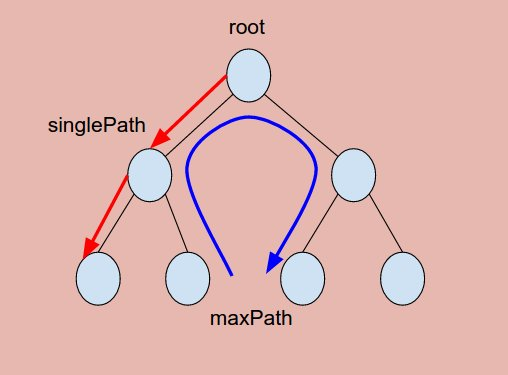

# Problem 124: Binary Tree Maximum Path Sum


> https://leetcode.com/problems/binary-tree-maximum-path-sum/

-------------------------------
##思路



1. singlePath: 从root往下走到任意点的最大路径，这条路径可以不包含任何点; maxPath: 从树中任意到任意点的最大路径，这条路径至少包含一个点
2. 分治思想：首先一分为二，left，right。然后分别再考虑他们的singlePath 和 maxPath。

--------------
```java
/**
 * Definition for a binary tree node.
 * public class TreeNode {
 *     int val;
 *     TreeNode left;
 *     TreeNode right;
 *     TreeNode(int x) { val = x; }
 * }
 */
public class Solution {
    public int maxPathSum(TreeNode root) {
        ResultType result = helper(root);
        return result.maxPath;
    }
    
    public class ResultType {
        int singlePath, maxPath;
        public ResultType (int singlePath, int maxPath) {
            this.singlePath = singlePath;
            this.maxPath = maxPath;
        }
    }
    
    private ResultType helper(TreeNode root) {
        if (root == null) {
            return new ResultType(0, Integer.MIN_VALUE);
        }
        
        //divide
        ResultType left = helper(root.left);
        ResultType right = helper(root.right);
        
        //conquer
        int singlePath = Math.max(left.singlePath, right.singlePath) + root.val;
        singlePath = Math.max(singlePath, 0);
        
        int maxPath = Math.max(left.maxPath, right.maxPath);
        maxPath = Math.max(maxPath, left.singlePath + right.singlePath + root.val);
        
        return new ResultType(singlePath, maxPath);
    }
}
```
--------------
##易错点

1. 边界条件
```java
if (root == null) {
    return new ResultType(0, Integer.MIN_VALUE);
}
```
最小值用的是```Integer.MIN_VALUE```而不是 Math

2. singlePath
```java
int singlePath = Math.max(left.singlePath, right.singlePath) + root.val;
singlePath = Math.max(singlePath, 0);
```
首先，左右两条道选一个大的，再带上root；其次，singlePath**有可能是一负数**

3. maxPath
```java
int maxPath = Math.max(left.maxPath, right.maxPath);
maxPath = Math.max(maxPath, left.singlePath + right.singlePath + root.val);
```
同理，首先，左右两条道选一个大的；其次考虑左右“单打”和图中“绕圈”哪个更大。


