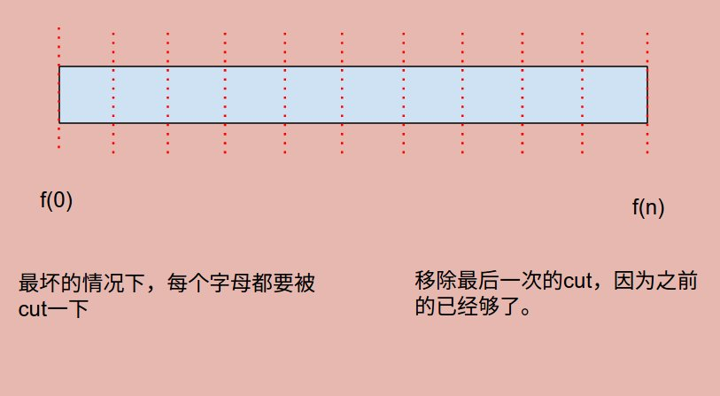

# Problem 132: Palindrome Partitioning II


> https://leetcode.com/problems/palindrome-partitioning-ii/

-----------------------------------------------
##思路
* 这道题的思路就是用一个一维数组去记录最小的cut。
* 注意去区分和 combination 当中 Palindrome Partitioning 题目的区别。那道题问一共有多少种 cut， 这肯定要用到搜索，排列组合的知识；而这道题问的是最少几种 cut，是最优问题，需要动态规划。 
 

-------------------------------------------------
```java
public class Solution {
    public int minCut(String s) {
        if (s == null || s.length() == 0) {
            return 0;
        }
        
        boolean[][] isPalindrome = getIsPalindrome(s);
        
        int[] f = new int[s.length() + 1];
        f[0] = 0;
        
        for (int i = 1; i <= s.length(); i++) {
            f[i] = Integer.MAX_VALUE;
            for (int j = 0; j < i; j++) {
                if (isPalindrome[j][i - 1]) {
                    f[i] = Math.min(f[i], f[j] + 1);
                }
            }
        }
        
        return f[s.length()] - 1;
    }
    
    private boolean[][] getIsPalindrome(String s) {
        boolean[][] isPalindrome = new boolean[s.length()][s.length()];
        
        //initialize
        for (int i = 0; i < s.length(); i++) {
            isPalindrome[i][i] = true;
        }
        for (int i = 0; i < s.length() - 1; i++) {
            isPalindrome[i][i + 1] = (s.charAt(i) == s.charAt(i + 1));
        }
        
        for (int length = 2; length < s.length(); length++) {
            for (int start = 0; start + length < s.length(); start++) {
                isPalindrome[start][start + length] = isPalindrome[start + 1][start + length - 1] && s.charAt(start) == s.charAt(start + length);
            }
        }
        
        return isPalindrome;
    } 
    
}
```

------------------------------------------------
##易错点

**分析下整个代码的流程**

1. 初始化f[n]
```java
boolean[][] isPalindrome = getIsPalindrome(s);       
int[] f = new int[s.length() + 1];
f[0] = 0;
```
如上图所示，建立f[n]，用来截止到目前位置的最小cut
2. update f[n]
```java
for (int i = 1; i <= s.length(); i++) {
     f[i] = Integer.MAX_VALUE;
     for (int j = 0; j < i; j++) {
          if (isPalindrome[j][i - 1]) {
          f[i] = Math.min(f[i], f[j] + 1);
          }
      }
}
```
f[i]设置成最大值，随后进行更新。首先要保证f[i - 1]是true，才能走过来。

3. 初始化```isPalindrome[][]```

```java
//initialize
for (int i = 0; i < s.length(); i++) {
     isPalindrome[i][i] = true;
}
for (int i = 0; i < s.length() - 1; i++) {
     isPalindrome[i][i + 1] = (s.charAt(i) == s.charAt(i + 1));
}
        
for (int length = 2; length < s.length(); length++) {
     for (int start = 0; start + length < s.length(); start++) {
     isPalindrome[start][start + length] = isPalindrome[start + 1][start + length - 1] && s.charAt(start) == s.charAt(start + length);
     }
}
```
首先对角线肯定是true；其次是相邻两个字符必须相等才能为true；最难的就是最后一个更新剩下的矩阵


