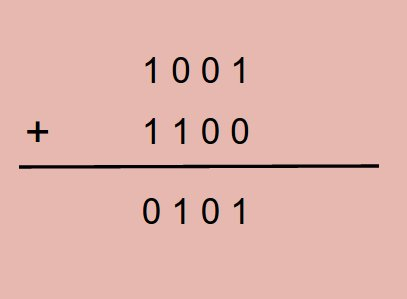
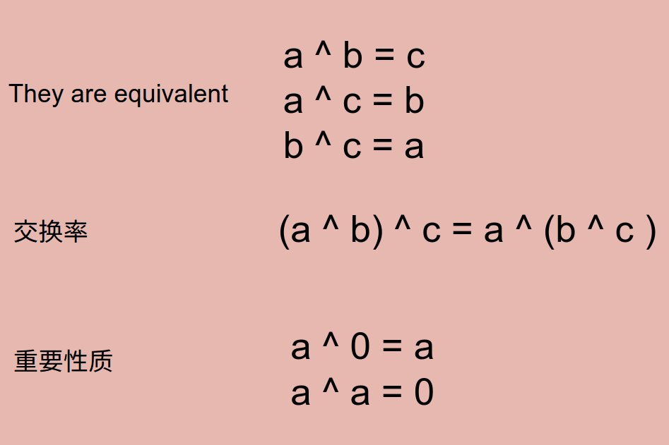

# Problem 136: Single Number


> https://leetcode.com/problems/single-number/

--------------
##思路
* 这道题用了异或关系的特性

* 异或关系性质



* 这道题我们就用最后两个的性质，最后剩下的就是那个落单的数字

-------------
```java
public class Solution {
    public int singleNumber(int[] nums) {
        if (nums == null || nums.length == 0) {
            return -1;
        }
        
        int result = nums[0];
        for (int i = 1; i < nums.length; i++) {
            result ^= nums[i];
        }
        return result;
    }
}
```


