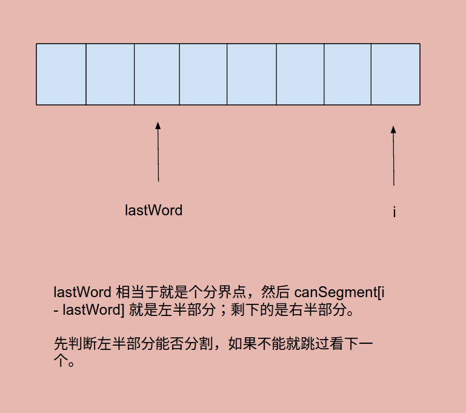
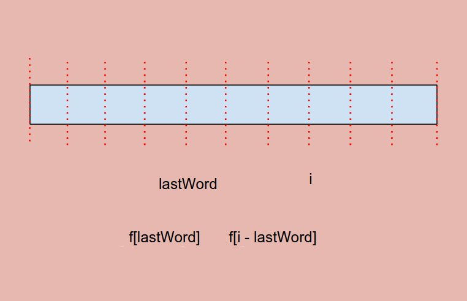

# Problem 139: Word Break


> https://leetcode.com/problems/word-break/

-------------------------------------------
##思路
* 这道题的思路类似于Palindrome Partitioning II。不过有不同的一点是，他加入了maxLength这个trick，只比到最大的长度就可以了。
* word break 要始终保证前面的元素存在一种方法是可以 break 的，这就要求每次都要判断前面的 true 或 false 值。



-------------------------------------------
```java
public class Solution {
    public boolean wordBreak(String s, Set<String> wordDict) {
        if (s == null || s.length() == 0) {
            return true;
        }
        
        int maxLength = getMaxLength(wordDict);
        // 动态规划的数组的 size 通常要加 1,因为之前有个 base
        boolean[] canSegment = new boolean[s.length() + 1];
        canSegment[0] = true;
        for (int i = 1; i <= s.length(); i++) { // dp 的循环一定是 <=，
                                                // 因为他的 size 比原来多一个
            // 首先设成 false
            canSegment[i] = false;
            for (int lastWord = 1; lastWord <= maxLength && lastWord <= i; lastWord++) {
                // 如果前半部分没法 break，那么就跳过，找下一个
                if (!canSegment[i - lastWord]) {
                    continue;
                }
                String word = s.substring(i - lastWord, i);
                if (wordDict.contains(word)) {
                    canSegment[i] = true;
                    break;
                }
            }
        }
        
        return canSegment[s.length()];
    }
    
    private int getMaxLength(Set<String> wordDict) {
        int maxLength = 0;
        for (String word : wordDict) {
            maxLength = Math.max(word.length(), maxLength);
        }
        return maxLength;
    }
    
}
```
------------------------------
##易错点

1. 数组长度
数组长度为```s.length() + 1```，也就是说从单词的开头到单词的屁股后面都要cut一下
2. 简化trick
```java
int lastWord = 1; lastWord <= maxLength && lastWord <= i; lastWord++
```
中间的这两个条件，相辅相成。lastWord不需要比最大的length大，因为再大了字典里就没有这个词了。
3. 跳过条件
```java
if (!canSegment[i - lastWord]) {
     continue;
}
```

这里的```lastWord```是标记位置。后面的```s.substring(i - lastWord, i)```,   
4. 我当时做的时候写的判断条件是：  
```java
String word = s.substring(lastword + 1, i);
```
这样写会报错，数据溢出；  
正确的写法应该是：  
```java
String word = s.substring(i - lastword, i);
```
原因就是 lastword 有可能会溢出的，比如一个字母作为单词的情况，lastword + 1 就溢出了。
另外，substring 方法：**后面的 string 不大写！**


