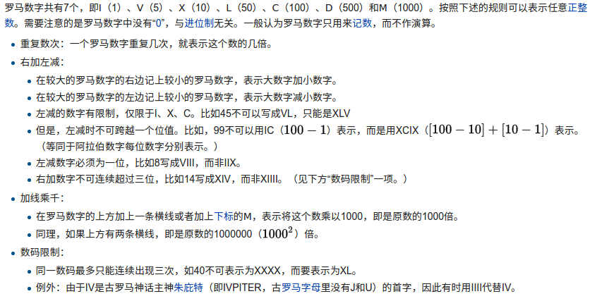

# Problem 13: Roman to Integer


> https://leetcode.com/problems/roman-to-integer/

---------
##思路
* 首先明白罗马数字是怎么读的.
>https://zh.wikipedia.org/wiki/%E7%BD%97%E9%A9%AC%E6%95%B0%E5%AD%97



* 用 HashMap 提前把这些字母都存好,为以后使用提供方便

---------
```java
public class Solution {
    public int romanToInt(String s) {
        if (s == null || s.length() == 0) {
            return 0;
        }
        
        Map<Character, Integer> map = new HashMap<Character, Integer>();
        map.put('I', 1);
        map.put('V', 5);
        map.put('X', 10);
        map.put('L', 50);
        map.put('C', 100);
        map.put('D', 500);
        map.put('M', 1000);
        
        int len = s.length();
        int num = map.get(s.charAt(len - 1));
        for (int i = len - 2; i >= 0; i--) {
            if (map.get(s.charAt(i + 1)) <= map.get(s.charAt(i))) {
                num += map.get(s.charAt(i));
            } else {
                num -= map.get(s.charAt(i));
            }
        }
        
        return num;
    }
}
```
-------
##易错点
1. 从最后一位开始记起, 循环的时候从**倒数第二位**往前面走。


