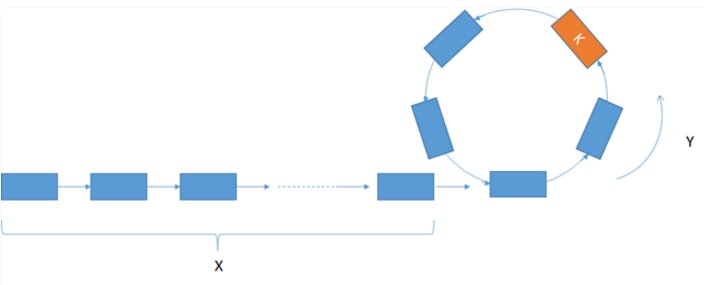

# Problem 142: Linked List Cycle II


> https://leetcode.com/problems/linked-list-cycle-ii/

------------
##思路


* 开始还是快慢指针的东西
* 发现有cycle之后（也就是说跳出了第一个while循环），head和slow同时出发，下次，head和slow.next相遇的时候，就是cycle的位置
* **无他，记住就好了**

------------
```java
/**
 * Definition for singly-linked list.
 * class ListNode {
 *     int val;
 *     ListNode next;
 *     ListNode(int x) {
 *         val = x;
 *         next = null;
 *     }
 * }
 */
public class Solution {
    public ListNode detectCycle(ListNode head) {
        if (head == null || head.next == null) {
            return null;
        }
        
        ListNode slow = head;
        ListNode fast = head.next;
        while (fast != slow) {
            if (fast == null || fast.next == null) {
                return null;
            }
            slow = slow.next;
            fast = fast.next.next;
        }
        
        while (head != slow.next) {
            head = head.next;
            slow = slow.next;
        }
        
        return head;
    }
}
```

------------
##易错点

1. 判断位置是看 head 和 slow.next 的相遇点
```java
while (head != slow.next) {
          head = head.next;
          slow = slow.next;
}
```


