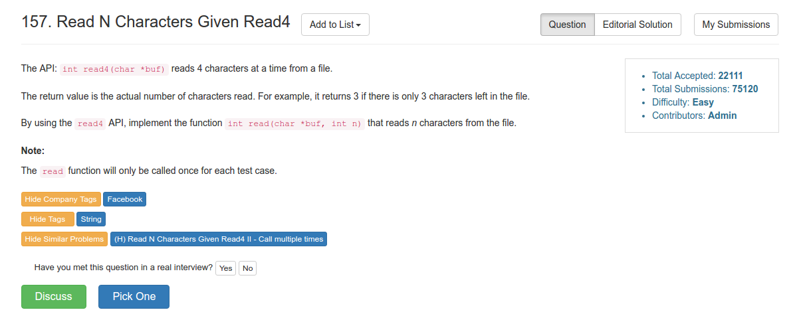

# Problem 157: Read N Characters Given Read4

> https://leetcode.com/problems/read-n-characters-given-read4/

----------



--------
##思路
* read4() 每次读取的元素是 4 个。如果 n 可以被 4 整除，那么正好读完；如果不能被 4 整除，那么就需要在 n 的时候截止。

-----------------
```java
/* The read4 API is defined in the parent class Reader4.
      int read4(char[] buf); */

public class Solution extends Reader4 {
    /**
     * @param buf Destination buffer
     * @param n   Maximum number of characters to read
     * @return    The number of characters read
     */
    public int read(char[] buf, int n) {
        char[] buf4 = new char[4];
        int count = 0;
        while (true) {
            int size = read4(buf4);
            for (int i = 0; i < size && count < n; i++) {
                buf[count++] = buf4[i];
            }
            
            if (size == 0 || count == n) {
                return count;
            }
        }
    }
}
```