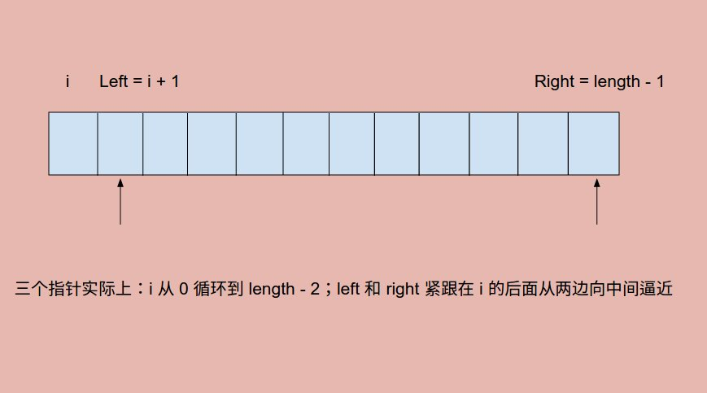

# Problem 15: 3Sum


> https://leetcode.com/problems/3sum/

----------
##复杂度
* 这篇文章分析得很好
> http://blog.csdn.net/whuwangyi/article/details/14104589
* 2sum 的算法复杂度是O(N log N) 因为排序用了 N log N 以及头尾指针的搜索是线性的，所以总体是O(N log N)
* 现在考虑3sum, 有了2sum 其实 3sum 就不难了，这样想：先取出一个数，那么我只要在剩下的数字里面找到两个数字使得他们的和等于(target – 那个取出的数)就可以了吧。所以 3sum 就退化成了 2sum, 取出一个数字，这样的数字有 N 个，所以 3sum 的算法复杂度就是**O(N^2)**, 注意这里复杂度是N平方，因为你排序只需要排一次，后面的工作都是取出一个数字，然后找剩下的两个数字，找两个数字是2sum用头尾指针线性扫，这里很容易错误的将复杂度算成O(N^2 log N)，这个是不对的。
* K-sum 问题最好也就能做到 **O(n^(K-1))** 复杂度


##思路
* 提前 sort 数组，保证了是从小到大排列的
* 三个指针一起扫遍整个数组。i 从左到右一直扫一遍（当然它不能都扫完，要留两个位置给 left 和 right）
* left 和 right 其实就是双指针逼近


-------------------
```java
public class Solution {
    public List<List<Integer>> threeSum(int[] nums) {
        List<Integer> tmp = new ArrayList<Integer>();
        List<List<Integer>> result = new ArrayList(tmp);
        
        if (nums == null || nums.length < 3) {
            return result;    
        }
        Arrays.sort(nums);
        for (int i = 0; i < nums.length - 2; i++) {
            if (i != 0 && nums[i] == nums[i - 1]) {
                continue;           // skip duplicate values 
            }
            
            int left = i + 1;
            int right = nums.length - 1;
            while (left < right) {
                int sum = nums[i] + nums[left] + nums[right];
                if (sum == 0) {
                    tmp = new ArrayList<Integer>();
                    tmp.add(nums[i]);
                    tmp.add(nums[left]);
                    tmp.add(nums[right]);
                    result.add(tmp);
                    left++;
                    right--;
                    while (left < right && nums[left] == nums[left - 1]) {
                        left++;
                    }
                    while (left < right && nums[right] == nums[right + 1]) {
                        right--;
                    }
                } else if (sum < 0) {
                    left++;
                } else {
                    right--;
                }
            }
            
        }
        
        return result;
    }
}
```
------
##易错点

1. 跳过 duplicate 元素
```java
if (i != 0 && nums[i] == nums[i - 1]) {
          continue;           // skip duplicate values 
}
```
```java
while (left < right && nums[left] == nums[left - 1]) {
           left++;
}
while (left < right && nums[right] == nums[right + 1]) {
           right--;
}
```
因为是要求不同的解的组合，重复的元素相当于是相同的解，没有意义。

2. 内层循环当中始终要考虑是否会破坏外层循环的条件
```java
while (left < right && nums[left] == nums[left - 1]) {
           left++;
}
```
3. 加入 tmp 的是元素，不是 index
```java
tmp.add(nums[i]);
tmp.add(nums[left]);
tmp.add(nums[right]);
result.add(tmp);
```


