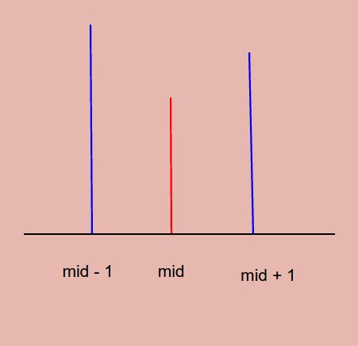
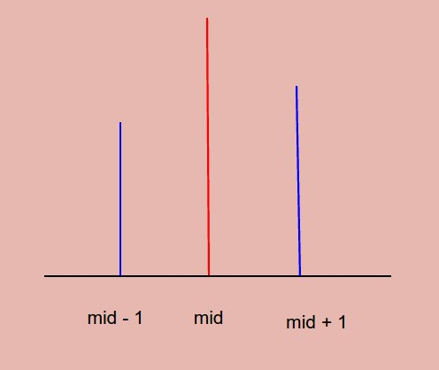

# Problem 162: Find Peak Element

> https://leetcode.com/problems/find-peak-element/

------------------
##思路
* 因为求的是任意一个peak，所以我们可以考虑使用二分法





* 无非就是三种情况：第一种就是，```nums[mid] < nums[mid - 1]```，说明peak在左边；第二种就是```nums[mid] < nums[mid + 1]```，说明peak在右边；最后一种情况，就是```nums[mid]```比他俩都高，那他本身就是一个peak！

---------
```java
public class Solution {
    public int findPeakElement(int[] nums) {
        if (nums == null || nums.length == 0) {
            return 0;
        }
        int start = 0;
        int end = nums.length - 1;
        int mid;
        while (start + 1 < end) {
            mid = start + (end - start) / 2;
            if (nums[mid] < nums[mid - 1]) {
                end = mid;
            } else if (nums[mid] < nums[mid + 1]) {
                start = mid;
            } else {
                return mid;
            }
        }
        if (nums[start] > nums[end]) {
            return start;
        } else {
            return end;
        }
    }
}
```
-----------
##易错点
1. 学会画图分析不同的局面，然后考虑最优解


