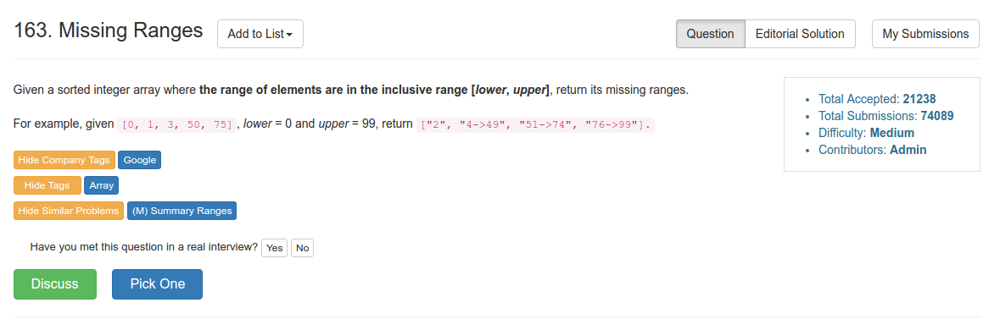

# Problem 163: Missing Ranges

> https://leetcode.com/problems/missing-ranges/

----------


--------
##思路
* 这道题的麻烦之处就在于，是否有 lower -> 第一个元素， 最后一个元素 -> upper，以及什么时候是单个元素，什么时候要加箭头
* 我们可以用双指针来实现，prev 和 cur。当他们之间相差大于 1 的时候就证明有一段丢失了。

-----------
```java
public class Solution {
    public List<String> findMissingRanges(int[] nums, int lower, int upper) {
        List<String> rst = new ArrayList<String>();
        long prev = lower - 1;
        long cur = 0;
        for (int i = 0; i <= nums.length; i++) {
            cur = i == nums.length ? upper + 1 : nums[i];
            if (cur - prev > 1) {
                rst.add(getRange(prev + 1, cur - 1));
            }
            prev = cur;
        }
        
        return rst;
    }
    
    private String getRange(long start, long end) {
        return start == end ? String.valueOf(start) : start + "->" + end;
    }
}
```
------
##易错点
1. 元素越界，所以用 long
```java
[2147483647]
0, 2147483647
```
这个 test case 就会越界
2. 循环次数
```java
for (int i = 0; i <= nums.length; i++)
```
之所以是 ```<=```是因为要考虑最后一个元素到 upper 这一段


