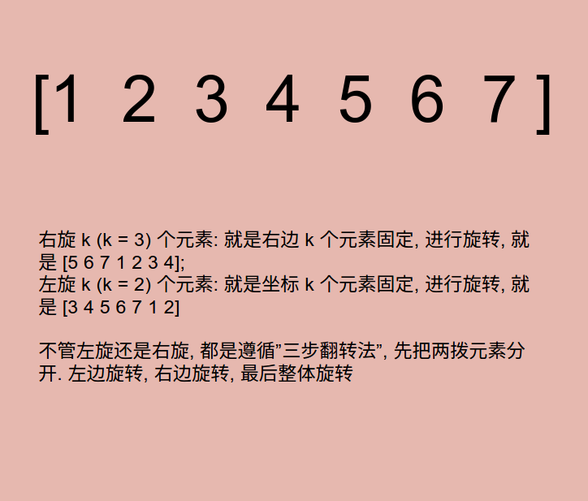

# Problem 189: Rotate Array


> https://leetcode.com/problems/rotate-array/

-------
##思路
*　三步翻转法



---------

```java
public class Solution {
    public void rotate(int[] nums, int k) {
        int len = nums.length;
        k = k % len;
        if (k > len) {
            return;
        }
        
        helper(nums, 0, len - k - 1);
        helper(nums, len - k, len - 1);
        helper(nums, 0, len - 1);
    }
    
    private void helper(int[] nums, int start, int end) {
        while (start < end) {
            swap(nums, start++, end--);
        }
    }
    
    private void swap(int[] nums, int a, int b) {
        int temp = nums[a];
        nums[a] = nums[b];
        nums[b] = temp;
    }
}
```
----
##易错点
１. k 有可能比数组长
```java
k = k % len;
```
2. index 之间的关系
```java
helper(nums, 0, len - k - 1);
helper(nums, len - k, len - 1);
helper(nums, 0, len - 1);
```


