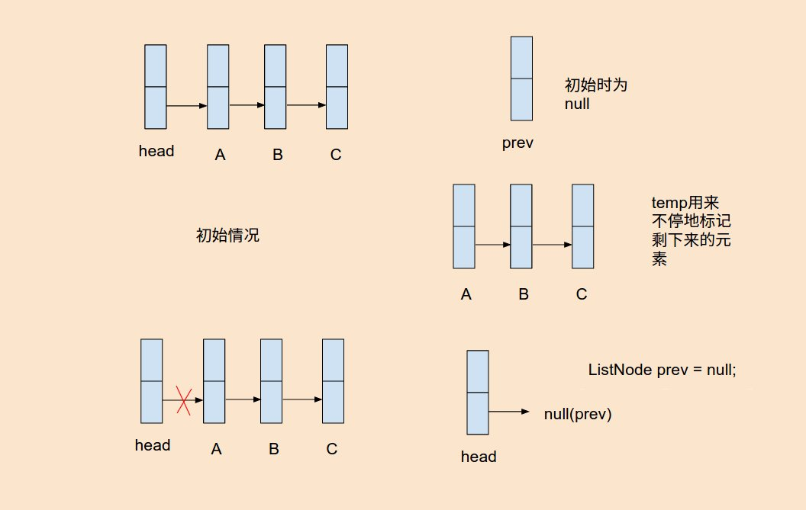
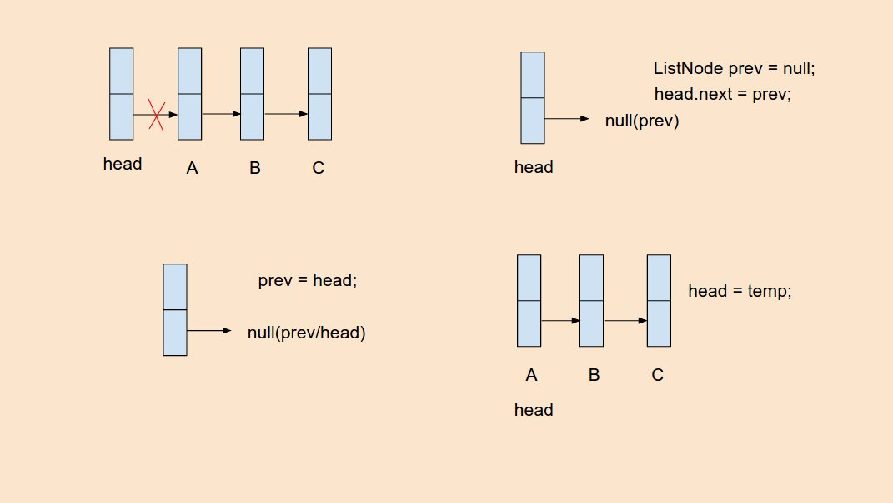
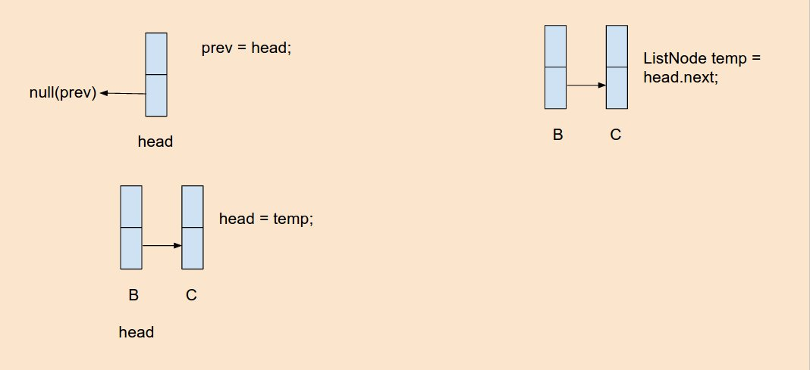
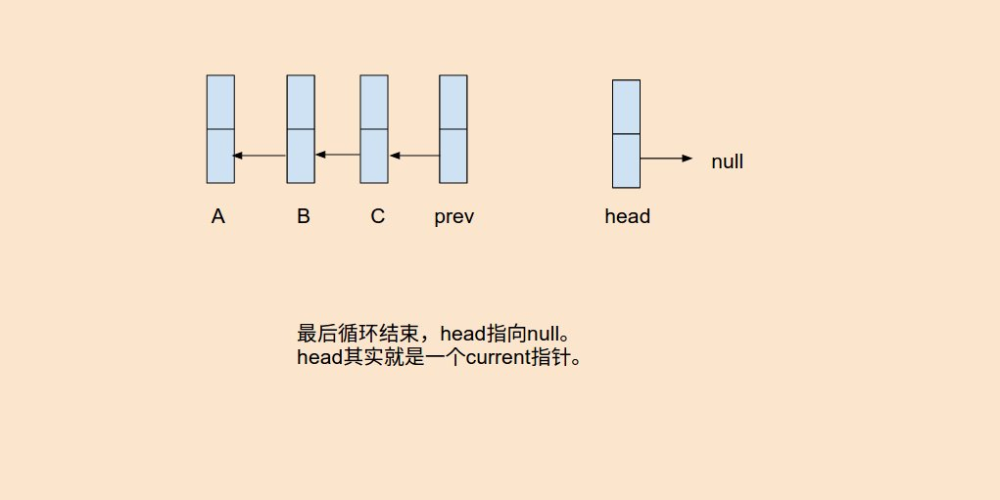

# Problem 206: Reverse Linked List


> https://leetcode.com/problems/reverse-linked-list/

---------------------------

##思路
这是一道经典并且基本的题目，理解这道题可以很好地理解 Linked List。先附上一个讲解的视频

> https://www.youtube.com/watch?v=sYcOK51hl-A

* 反转链表，主要地是要学会反转指针
* 思路上可以说就是交换所有的prev和next指针










---------------------------
```java
/**
 * Definition for singly-linked list.
 * public class ListNode {
 *     int val;
 *     ListNode next;
 *     ListNode(int x) { val = x; }
 * }
 */
public class Solution {
    public ListNode reverseList(ListNode head) {
        if (head == null) {
            return head;
        }
        
        ListNode prev = null;
        while (head != null) {
            ListNode temp = head.next;
            head.next = prev;
            prev = head;
            head = temp;
        }
        return prev;
    }
}
```
----------------
##易错点
1. 始终牢记一点就是，prev和next进行交换
2. 在反转指针的过程中，当断开链接的时候，我们就对剩下的元素失去了track，所以提前用temp存起来，以后用的时候再调出来。
3. head指针其实是current指针，随着他的移动，不停地更新链表
4. 最后结束的时候，其实头是prev指针
5. while循环一遍的时候并没有交换完成一遍，循环好几遍的时候才完成指针的反转


