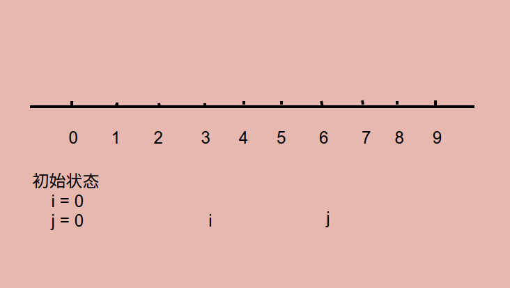

# Problem 209: Minimum Size Subarray Sum

> https://leetcode.com/problems/minimum-size-subarray-sum/

-----
##思路
* 两根指针滑动窗口，同时维护一个 sum 值


---
```java
public class Solution {
    public int minSubArrayLen(int s, int[] nums) {
        if (nums == null || nums.length == 0) {
            return 0;
        }
        
        int i = 0, j = 0;
        int sum = 0;
        int size = Integer.MAX_VALUE;
        for (i = 0; i < nums.length; i++) {
            while (j < nums.length && sum < s) {
                sum += nums[j];
                j++;
            }
            if (sum >= s) {
                size = Math.min(size, j - i);
            }
            sum -= nums[i];
        }
        
        if (size == Integer.MAX_VALUE) {
            return 0;
        }
        
        return size;
    }
}
```
-----
##易错点
1. 滑动窗口之后，在 sum 里面减去 nums[i]: ```sum -= nums[i];```


