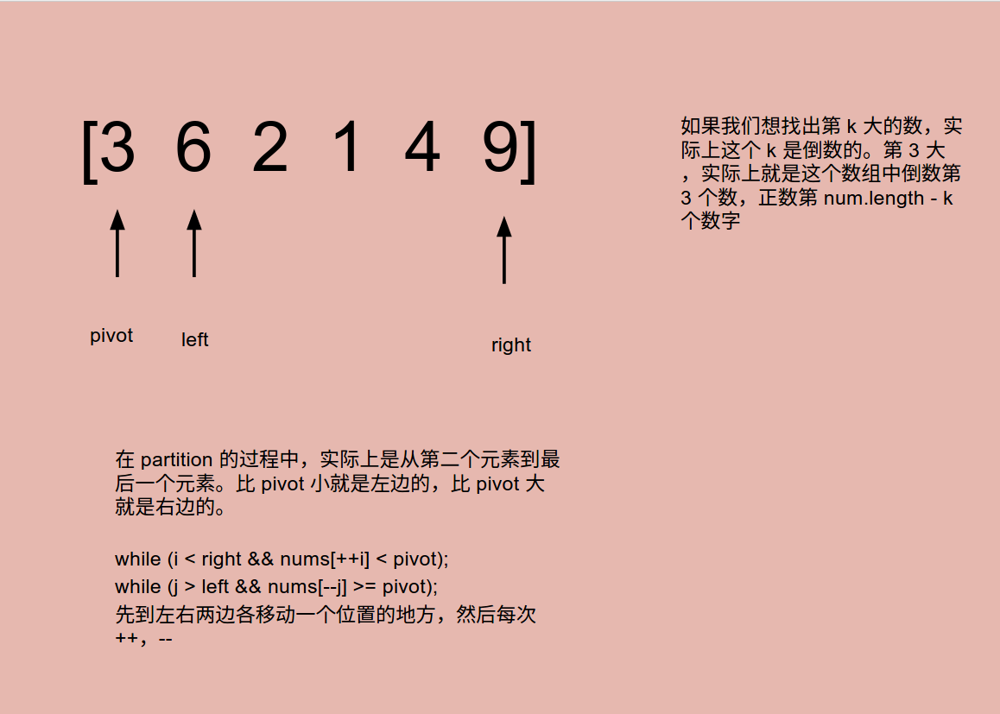

# Problem 215: Kth Largest Element in an Array


> https://leetcode.com/problems/kth-largest-element-in-an-array/

-------------
##思路
* 这道题可以用 heap 快速做出，但其并不是考点。
* 这道题的考点还是在 O(N) 的时间内，用额外 O(1) 的时间找出结果。所以我们考虑用 Quick Sort 的方法。

* 后面有两个版本，一个是用 sort 做的，另一个是用 heap 做的。heap 在 java 中用 PriorityQueue 实现。
-----------
```java
public class Solution {
    public int findKthLargest(int[] nums, int k) {
        k = nums.length - k;
        int left = 0, right = nums.length - 1;
        while (left < right) {
            int position = partition(nums, left, right);
            if (position == k) {
                break;
            } else if (position < k) {
                left = position + 1;
            } else {
                right = position - 1;
            }
        }
        
        return nums[k];
    }
    
    private int partition(int[] nums, int left, int right) {
        int i = left;
        int j = right + 1;
        int pivot = nums[left];
        while (true) {
            while (i < right && nums[++i] < pivot);
            while (j > left && nums[--j] >= pivot);
            if (i >= j) {
                break;
            }
            swap(nums, i, j);
        }
        swa
        p(nums, left, j);
        return j;
    }
    
    private void swap(int[] nums, int i, int j) {
        int tmp = nums[i];
        nums[i] = nums[j];
        nums[j] = tmp;
    }
}
```
```java
/*
  sort version:
*/
public class Solution {
    public int findKthLargest(int[] nums, int k) {
        Arrays.sort(nums);
        int len = nums.length;
      
        return nums[len - k];
    }
}
```
```java
/*
  heap version
*/
public class Solution {
    public int findKthLargest(int[] nums, int k) {
        PriorityQueue<Integer> heap = new PriorityQueue<Integer>();
        for (Integer i : nums) {
            heap.offer(i);
            if (heap.size() > k) {
                heap.poll();
            }
        }
        
        return heap.peek();
    }
}
```
------
##易错点

1. 搞清第 k 大的意思
```java
k = nums.length - k;
```
2. 提前左右各向外移动一个位置，然后再往回逼近
```java
while (i < right && nums[++i] < pivot);
while (j > left && nums[--j] >= pivot);
```
第二个 while 是 >= 因为最后要找的是第 k 大的元素
3. swap，swap 的是 i，j 位置上的值
```java
// 第一次交换，pivot 两边的值交换
swap(nums, i, j); 
// 第二次是把 pivot 换到“大”组去
swap(nums, left, j);
// 找到 partition 位置
return j;
```


