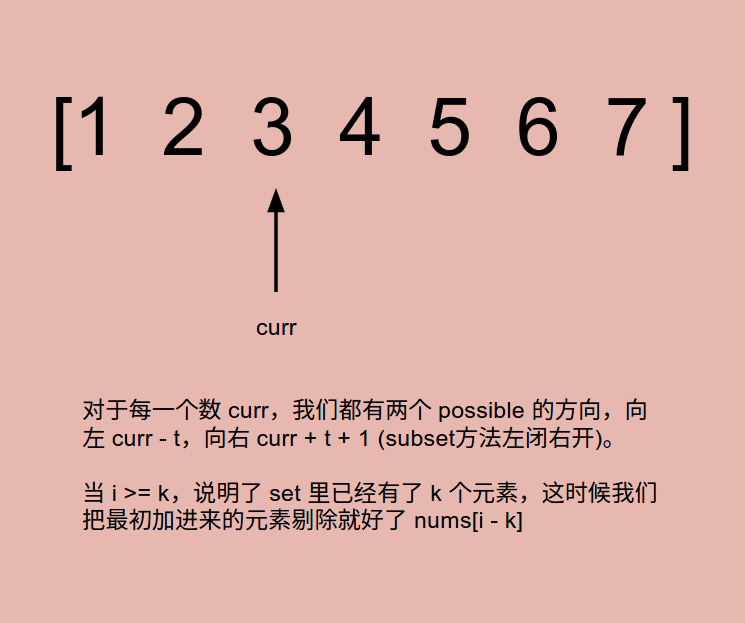

# Problem 220: Contains Duplicate III

> https://leetcode.com/problems/contains-duplicate-iii/

----------
##思路



----------
```java
public class Solution {
    public boolean containsNearbyAlmostDuplicate(int[] nums, int k, int t) {
        if (nums.length < 2 || k < 0 || t < 0) {
            return false;
        }
        SortedSet<Long> set = new TreeSet<Long>();

        for (int i = 0; i < nums.length; i++) {
            long curr = (long) nums[i];
            long leftBound = (long) curr - t;
            long rightBound = (long) curr + t + 1;
            
            SortedSet<Long> subset = set.subSet(leftBound, rightBound);
            if (subset.size() > 0) {
                return true;
            }
            set.add((long) nums[i]);
            if (i >= k) {
                set.remove((long) nums[i - k]);
            }
            
        }
        
        return false;
    }
}
```
---
##易错点
1. 数据溢出，用 long 存储
```java
SortedSet<Long> set = new TreeSet<Long>();
```
Long 是类，对应 Integer;  
long 是数据类型，对应 int
2. SortedSet 类用 TreeSet 实现
```java
SortedSet<Long> set = new TreeSet<Long>();
```
3. subSet 方法左闭右开
```java
SortedSet<Long> subset = set.subSet(leftBound, rightBound);
```
所以 rightBound 要加 1
```java
long rightBound = (long) curr + t + 1;
```


