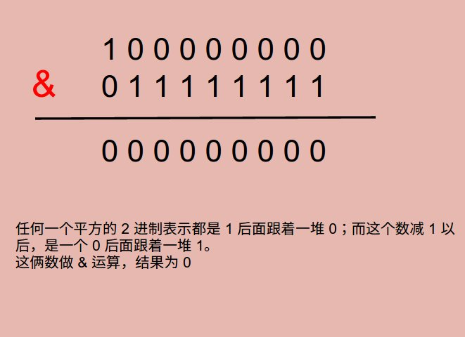

# Problem 231: Power of Two


> https://leetcode.com/problems/power-of-two/

---------------
##思路

----------
```java
public class Solution {
    public boolean isPowerOfTwo(int n) {
        if (n <= 0) {
            return false;
        }
        
        return ((n - 1) & n) == 0;
    }
}
```
-------------
##易错点

1. 这道题里认为 0 不算平方，所以开头要把它排除
2. 做 & 运算加括号！否则会先判断 n == 0
```java
return ((n - 1) & n) == 0;
```


