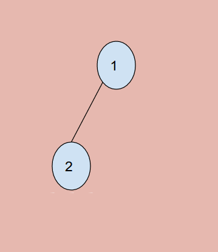

# Problem 235: Lowest Common Ancestor of a Binary Search Tree


> https://leetcode.com/problems/lowest-common-ancestor-of-a-binary-search-tree/

---------------
##思路
* 这道题和上一道题的区别就是：这是 bst，多了一些条件可以利用，从而可以节省更多的时间。bst 本身就是二叉树，直接拿来上一题的答案完全没问题
* 那我们如何利用更多的条件呢？因为 bst 左 - root - 右 这样一个大小顺序，所以我们完全判断：如果俩值都比 root 小，那么在左边；如果都大，在右边；root 两边一边一个，返回 root。

--------------


```java
/**
 * Definition for a binary tree node.
 * public class TreeNode {
 *     int val;
 *     TreeNode left;
 *     TreeNode right;
 *     TreeNode(int x) { val = x; }
 * }
 */
public class Solution {
    public TreeNode lowestCommonAncestor(TreeNode root, TreeNode p, TreeNode q) {
        if (root == null || root == p || root == q) return root;
        
        if (p.val < root.val && q.val < root.val) {
            return lowestCommonAncestor(root.left, p, q);
        } else if (p.val > root.val && q.val > root.val) {
            return lowestCommonAncestor(root.right, p, q);
        } else {
            return root;
        }
        
    }
}
```

-----
* 原先 binary tree 解法

```java
/**
 * Definition for a binary tree node.
 * public class TreeNode {
 *     int val;
 *     TreeNode left;
 *     TreeNode right;
 *     TreeNode(int x) { val = x; }
 * }
 */
public class Solution {
    public TreeNode lowestCommonAncestor(TreeNode root, TreeNode p, TreeNode q) {
        if (root == null || root == p || root == q) {
            return root;
        }
        
        TreeNode left = lowestCommonAncestor(root.left, p, q);
        TreeNode right = lowestCommonAncestor(root.right, p, q);
        if (left != null && right != null) {
            return root;
        }
        if (left != null) {
            return left;
        }
        if (right != null) {
            return right;
        }
        
        return null;
    }
}
```
-----
##易错点

1. 分治递归的思路很简单，但是难点在于退出条件上
```java
if (root == null || root == p || root == q) {
         return root;
}
```
我开头少考虑了一点，只想到了 ```root == null``` 这一种情况。

这种情况的时候，就应该返回 1 了， 1 就是他俩的 LCA。


