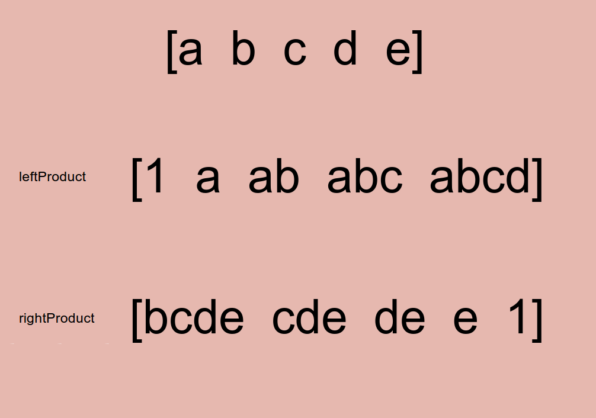

# Problem 238: Product of Array Except Self


> https://leetcode.com/problems/product-of-array-except-self/

---------
##思路


--------
```java
public class Solution {
    public int[] productExceptSelf(int[] nums) {
        int len = nums.length;
        int[] product = new int[len];
        
        int[] leftProduct = new int[len];
        leftProduct[0] = 1;
        for (int i = 1; i < len; i++) {
            leftProduct[i] = leftProduct[i - 1] * nums[i - 1];
        }
        
        int[] rightProduct = new int[len];
        rightProduct[len - 1] = 1;
        for (int i = len - 2; i >= 0; i--) {
            rightProduct[i] = rightProduct[i + 1] * nums[i + 1];
        } 
        
        for (int i = 0; i < len; i++) {
            product[i] = leftProduct[i] * rightProduct[i];
        }
        
        return product;
    }
}
```
