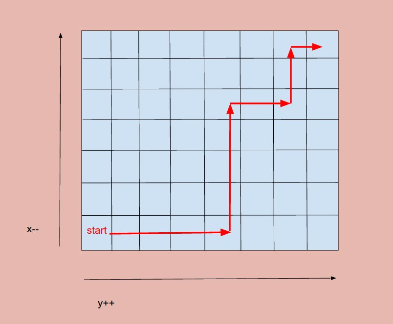

# Problem 240: Search a 2D Matrix II


> https://leetcode.com/problems/search-a-2d-matrix-ii/

---------------------------------------------------

##思路


首先要想清楚出发点。**为什么我们从左下角一路出发？**

因为这个点十分关键，他起到了四分法的作用。相当于他在角落里，进可攻退可守。比他大，只能往右走，比他小，只能往左走。

---------------------
```java
public class Solution {
    public boolean searchMatrix(int[][] matrix, int target) {
        if (matrix == null || matrix.length == 0) {
            return false;
        }
        if (matrix[0] == null || matrix[0].length == 0) {
            return false;
        }
        
        int n = matrix.length;
        int m = matrix[0].length;
        int x = n - 1;
        int y = 0;
        while (x >= 0 && y < m) {
            if (target == matrix[x][y]) {
                return true;
            } else if (target > matrix[x][y]) {
                y++;
            } else {
                x--;
            }
            
        }
        
        return false;
    }
}
```
---------------------
##易错点

1. 找好定位点
```java
int n = matrix.length;
int m = matrix[0].length;
int x = n - 1;
int y = 0;
```


