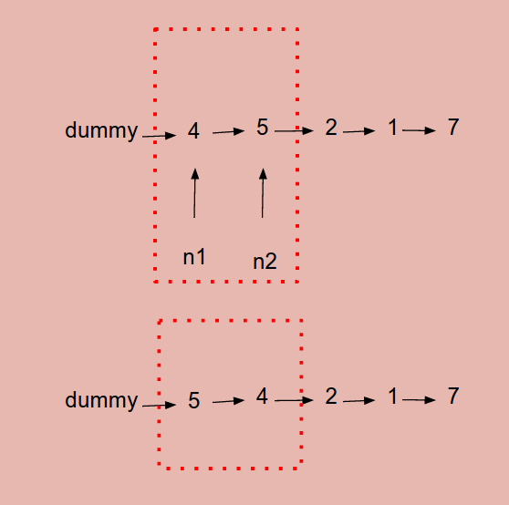

# Problem 24: Swap Nodes in Pairs


> https://leetcode.com/problems/swap-nodes-in-pairs/

---------
##思路
* 考察的主要就是两根指针的移动，和上一题很像


--------
```java
/**
 * Definition for singly-linked list.
 * public class ListNode {
 *     int val;
 *     ListNode next;
 *     ListNode(int x) { val = x; }
 * }
 */
public class Solution {
    public ListNode swapPairs(ListNode head) {
        ListNode dummy = new ListNode(0);
        dummy.next = head;
        
        head = dummy;
        while (head.next != null && head.next.next != null) {
            ListNode n1 = head.next;
            ListNode n2 = head.next.next;
            
            // swap
            head.next = n2;
            n1.next = n2.next;
            n2.next = n1;
            
            head = n1;
        }
        
        return dummy.next;
    }
}
```

-------
##易错点
1. dummy node 必须要存在，因为涉及到交换 node 的时候，“头”就乱了。
2. while 的循环条件，是 head.next.next != null； 因为要涉及两根指针 n1 和 n2
3. 交换完指针记得 update head 指针
```java
head.next = n2;
n1.next = n2.next;
n2.next = n1;
            
head = n1;
```


