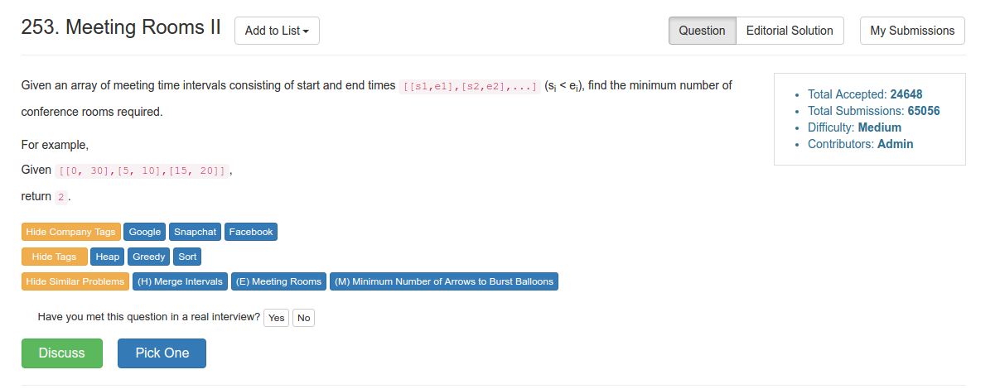

# Problem 253: Meeting Rooms II


> https://leetcode.com/problems/meeting-rooms-ii/

----------------


-------
##思路
* 这道题是上一题的升级：也就是说有多少个 meeting 是 confilct 的就得有多少 room。
* 还是和上一题一样，首先对所有的 meeting 按照 start 的顺序排序，然后，用一个堆来维护当前 meeting 的 end。如果有冲突，room++；如果没有冲突，说明完美解决，把当前的 end poll 出来，offer 进新的 end。

--------------
##变形
* Google面经中一个叫做Flight Schedule的题目，其实和此题一模一样
> Given a schedule of flights, can you write an algorithm to count the minimum number of planes needed?

----------

```java
/**
 * Definition for an interval.
 * public class Interval {
 *     int start;
 *     int end;
 *     Interval() { start = 0; end = 0; }
 *     Interval(int s, int e) { start = s; end = e; }
 * }
 */
public class Solution {
    public int minMeetingRooms(Interval[] intervals) {
        if (intervals == null || intervals.length == 0) {
            return 0;
        }
        
        Arrays.sort(intervals, new Comparator<Interval>() {
            public int compare(Interval i1, Interval i2) {
                return i1.start - i2.start;
            }
        });
        
        int numRoom = 1;
        PriorityQueue<Integer> maxEnd = new PriorityQueue<Integer>();
        maxEnd.offer(intervals[0].end);
        for (int i = 1; i < intervals.length; i++) {
            if (intervals[i].start < maxEnd.peek()) {
                numRoom++;
            } else {
                maxEnd.poll();
            }
            maxEnd.offer(intervals[i].end);
        }
        
        return numRoom;
    }
}
```
