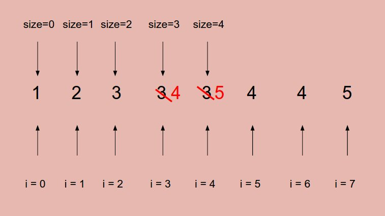

# Problem 26: Remove Duplicates from Sorted Array


> https://leetcode.com/problems/remove-duplicates-from-sorted-array/

---------
##思路


* 循环一遍数组，用size来标记不同的元素，相当于是两个指针，一个是```i```，一个是```size```
* 当```size```和```i```对应的值不一样的时候，```size```往前挪一个，并且把```i```的值copy过来
* 因为```i```走得比```size```快，所以都是```size```来适应```i```的变化。

-----------
```java
public class Solution {
    public int removeDuplicates(int[] nums) {
        if (nums == null || nums.length == 0) {
            return 0;
        }
        
        int size = 0;
        for (int i = 0 ; i < nums.length; i++) {
            if (nums[i] != nums[size]) {
                size++;
                nums[size] = nums[i];
            }
        }
        
        return size + 1;
    }
}
```

--------
##易错点
1. 记得size要加1的最后。
2. 先移动size，再copy值过来
```java
size++;
nums[size] = nums[i];
```
可以简写为
```java
nums[++size] = nums[i];
```
3. 开始 size 是作为指针使用的，最后的返回值是真正的 “size”


