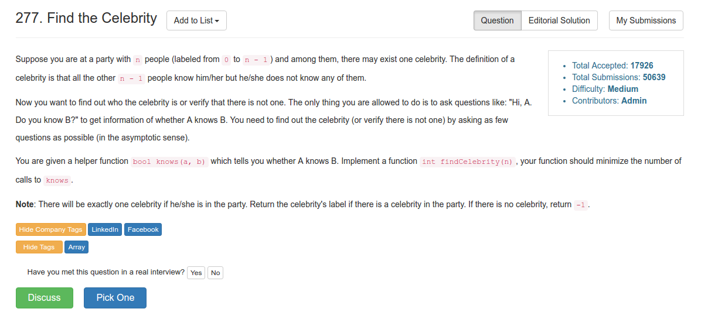

# Problem 277: Find the Celebrity

> https://leetcode.com/problems/find-the-celebrity/

-------------


---------
##思路
* 可以用双指针来做。```knows(a, b)```如果成立，那么 a 肯定不是，因为 celebrity 不认识任何无名鼠辈；同理```！knows(a, b)```如果成立，b 肯定不是，因为无名鼠辈们都不认识他。
* 通过双指针扫一遍以后，大概可以逼近到 left，right 了。然后再扫一遍，用来 check left 到底是不是。

-----------
```java
/* The knows API is defined in the parent class Relation.
      boolean knows(int a, int b); */

public class Solution extends Relation {
    public int findCelebrity(int n) {
        int left = 0, right = n - 1;
        while (left < right) {
            if (knows(left, right)) {
                left++;
            } else {
                right--;
            }
        }
        
        for (int i = 0; i < n; i++) {
            if (i == left || (knows(i, left) && !knows(left, i))) {
                continue;
            } else {
                return -1;
            }
        }
        
        return left;
    }；
}
```
----------
##易错点
1. check left 到底是不是
```java
if (i == left || (knows(i, left) && !knows(left, i))) {
         continue;
} else {
         return -1;
}
```
left 本身不需要判断认不认识自己，所以跳过。其他人必须挨个表态，只要有不符合的，立马返回 -1


