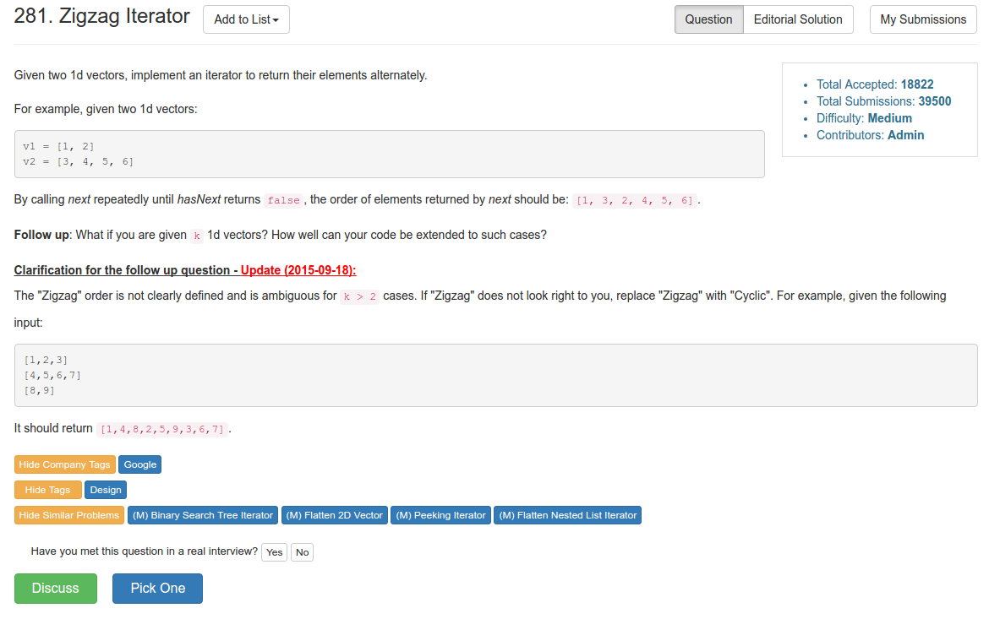

# Problem 281: Zigzag Iterator

> https://leetcode.com/problems/zigzag-iterator/

----------------


------------
##思路
* 因为这里是交叉打印的，所以有一个简单的方法是交换两者的顺序。这样，该打印 i1 的时候，打印 i2；反之依然。

----------
```java
public class ZigzagIterator {

    private Iterator<Integer> i1, i2, tmp;
    
    public ZigzagIterator(List<Integer> v1, List<Integer> v2) {
        i1 = v1.iterator();
        i2 = v2.iterator();
    }

    public int next() {
        if (i1.hasNext()) {
            tmp = i1;
            i1 = i2;
            i2 = tmp;
        }
        
        return i2.next();
    }

    public boolean hasNext() {
        return i1.hasNext() || i2.hasNext();
    }
}

/**
 * Your ZigzagIterator object will be instantiated and called as such:
 * ZigzagIterator i = new ZigzagIterator(v1, v2);
 * while (i.hasNext()) v[f()] = i.next();
 */
```
---
##变形

>  What if you are given k 1d vectors? How well can your code be extended to such cases?

```java
public class ZigzagIterator {
    
    // Better solution, 6ms
    Queue<Iterator> q;

    public ZigzagIterator(List<Integer> v1, List<Integer> v2) {
        q = new LinkedList();
        if (!v1.isEmpty()) q.offer(v1.iterator());
        if (!v2.isEmpty()) q.offer(v2.iterator());
    }

    public int next() {
        Iterator cur = q.poll();
        int res = (int) cur.next();
        if (cur.hasNext()) q.offer(cur);
        return res;
    }

    public boolean hasNext() {
        return q.peek() != null;
    }
}
```


