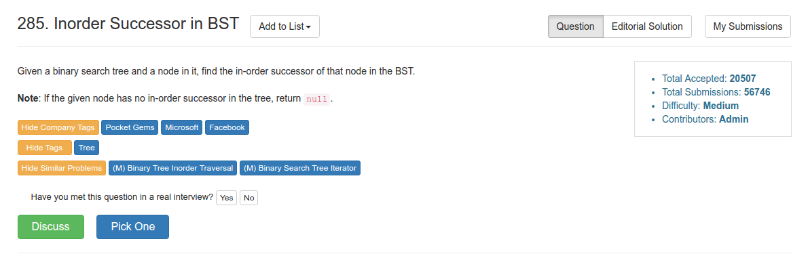

# Problem 285: Inorder Successor in BST

> https://leetcode.com/problems/inorder-successor-in-bst/

--------------



-------
##思路
* succesoor 肯定是当前结点的右子树的最左边。可以用递归来解决。
* 如果 p 比 root 大，那么就在右边找；反之如果 p 比 root 小，就在左边找最 left 的元素。

--------
```java
/**
 * Definition for a binary tree node.
 * public class TreeNode {
 *     int val;
 *     TreeNode left;
 *     TreeNode right;
 *     TreeNode(int x) { val = x; }
 * }
 */
public class Solution {
    public TreeNode inorderSuccessor(TreeNode root, TreeNode p) {
        if (root == null) {
            return root;
        }
        
        if (root.val <= p.val) {
            return inorderSuccessor(root.right, p);
        } else {
            TreeNode left = inorderSuccessor(root.left, p);
            return left != null ? left : root;
        }
    }
}
```
------
##变形

> Inorder predecessor in BST

```java
public TreeNode inorderPredecessor(TreeNode root, TreeNode p) {
    if (root == null) {
        return root;
    }

    if (root.val >= p.val) {
        return inorderPredecessor(root.left, p);
    } else {
        TreeNode right = inorderPredecessor(root.right, p);
        return right != null ? right : root;
    }
}
```


