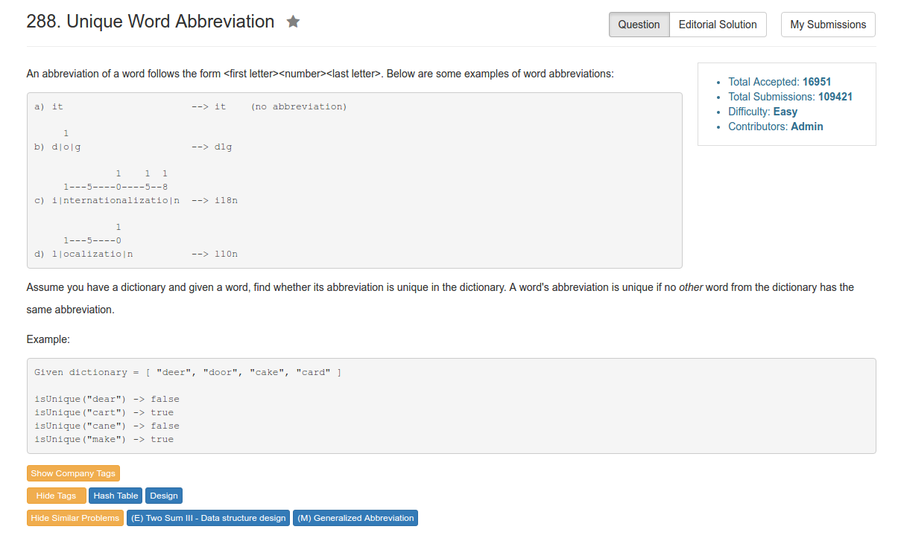

# Problem 288: Unique Word Abbreviation


> https://leetcode.com/problems/unique-word-abbreviation/

------------------------------

##题目

----------
##思路
* 相当于给每一个 word 加密，得到一个 key，再把 key 存到 HashMap 里面去。
* 当有两个不同的 word 对应同一个 key 的时候，这个 key 就已经可以认为是 "作废" 了。

----------------
```java
public class ValidWordAbbr {

    HashMap<String, String> map;
    public ValidWordAbbr(String[] dictionary) {
        map = new HashMap<String, String>();
        for (String word : dictionary) {
            String key = getKey(word);
            if (map.containsKey(key)) {
                if (!map.get(key).equals(word)) {  // If there is more than one string belong to the same key
                                                // then the key will be invalid, we set the value to ""
                    map.put(key, "");
                }
            } else {
                map.put(key, word);
            }
        }
    }

    public boolean isUnique(String word) {
        return !map.containsKey(getKey(word)) || map.get(getKey(word)).equals(word);
    }
    
    private String getKey(String s) {
        if (s.length() <= 2) return s;
        String key = s.charAt(0) + Integer.toString(s.length() - 2) + s.charAt(s.length() - 1);
        return key;
    }
}


// Your ValidWordAbbr object will be instantiated and called as such:
// ValidWordAbbr vwa = new ValidWordAbbr(dictionary);
// vwa.isUnique("Word");
// vwa.isUnique("anotherWord");
```
---------
##易错点
1. 判断是否为 unique
```java
return !map.containsKey(getKey(word)) || map.get(getKey(word)).equals(word);
```
第一种情况是压根儿没这 key，肯定是 unique 的啦;第二种情况，是含有这个 key，但就是字典里那个元素，所以这俩词其实是一个词儿，还是 unique 的
2. Integer 的 toString() 方法
>https://www.tutorialspoint.com/java/lang/integer_tostring_int.htm


