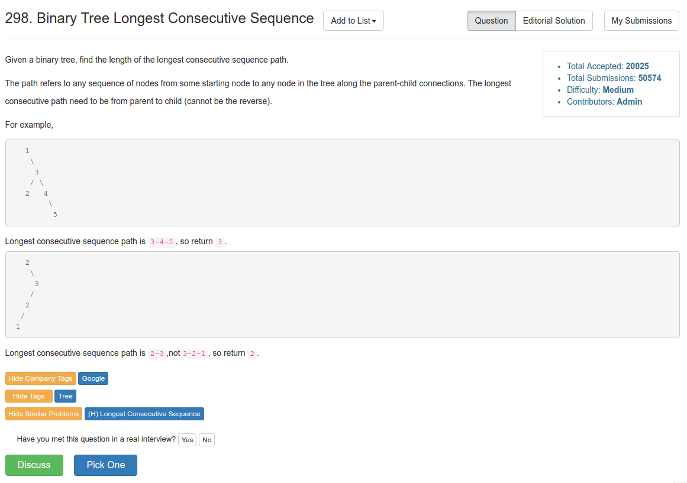

# Problem 298: Binary Tree Longest Consecutive Sequence

> https://leetcode.com/problems/binary-tree-longest-consecutive-sequence/

-------



----------
##思路
* 涉及到二叉树的题目一般情况都要进行遍历（或者分治）。
* 可以用一个全局变量来维护 max 值，然后用一个 cur 变量来 track 进行到了哪一步。最后取最大值。

--------
##复杂度
* Time: $$O(n)$$
* Space: $$O(n)$$

----------

```java
/**
 * Definition for a binary tree node.
 * public class TreeNode {
 *     int val;
 *     TreeNode left;
 *     TreeNode right;
 *     TreeNode(int x) { val = x; }
 * }
 */
public class Solution {
    int max = 0;
    public int longestConsecutive(TreeNode root) {
        if (root == null) {
            return 0;
        }
        
        helper(root, 0, root.val);
        return max;
    }
    
    private void helper(TreeNode root, int cur, int target) {
        if (root == null) {
            return;
        }
        
        if (root.val == target) {
            cur++;
        } else {
            cur = 1;
        }
        max = Math.max(max, cur);
        
        helper(root.left, cur, root.val + 1);
        helper(root.right, cur, root.val + 1);
    }
}
```
--------
##易错点
1. 递归函数的 parameters 都是变量，不能放常量，比如 target
```java
helper(root.left, cur, root.val + 1);
```


