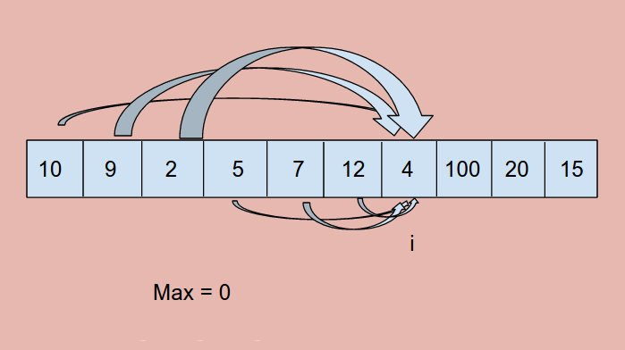

# Problem 300: Longest Increasing Subsequence


> https://leetcode.com/problems/longest-increasing-subsequence/

---------------------------------
##思路
依然是寻找递推关系，看```f[i]```和```f[j] + 1```两者谁大。

----------------------------------------
```java
public class Solution {
    public int lengthOfLIS(int[] nums) {
        if (nums == null || nums.length == 0) {
            return 0;
        }
        
        int max = 0;
        int[] f = new int[nums.length];
        
        for (int i = 0; i < nums.length; i++) {
            f[i] = 1;
            for (int j = 0; j < i; j++) {
                if (nums[j] < nums[i]) {
                    f[i] = f[i] > f[j] + 1 ? f[i] : f[j] + 1;
                }
            }
            if (f[i] > max) {
                max = f[i];
            }
        }
        return max;
    }
}
```

------------------
##易错点

1. 核心部分
```java
for (int i = 0; i < nums.length; i++) {
      f[i] = 1;
      for (int j = 0; j < i; j++) {
           if (nums[j] < nums[i]) {
               f[i] = f[i] > f[j] + 1 ? f[i] : f[j] + 1;
           }
      }
      if (f[i] > max) {
           max = f[i];
      }
}
```


作为第```i```号位置的元素，前面的每一个元素```j```都要和他进行相比，如果元素```j```小于元素```i```，那么max就要进行一次更迭。

其中，```f[i] > f[j] + 1```是为了选出一次当中最大的```i```值。


