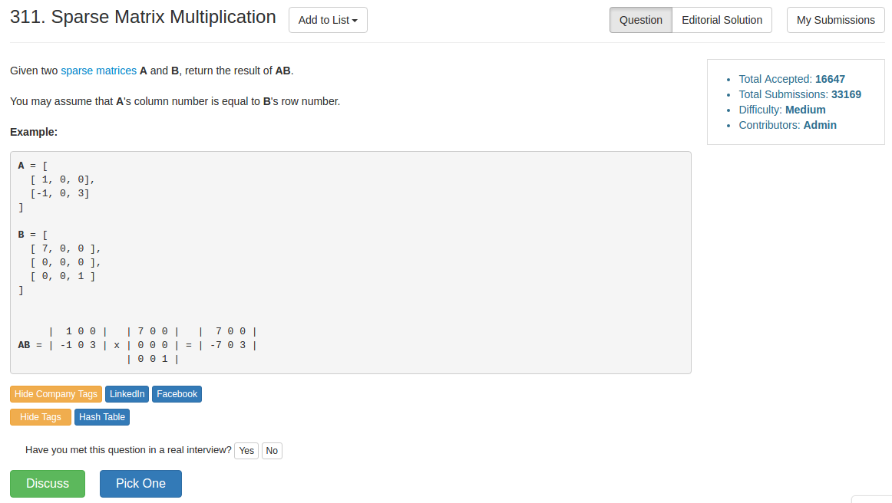

# Problem 311: Sparse Matrix Multiplication


> https://leetcode.com/problems/sparse-matrix-multiplication/

-----------


---------
##思路
* 这道题如果用常规的矩阵乘法会超时，因为这里不是常规的矩阵，而是 sparse matrix，也就是说这个矩阵里大多数的元素都是 0, 只有零星的几个元素非 0，所以我们没必要浪费时间在每个元素上，只需要记录那些 non-zero 的元素即可
* 如果 rowA 或者 colB 都是 0 的话，那么最后的结果肯定也是 0。所以，我们可以用两个数组来记录是否为 non-zero
* 对每一个元素来说，$$rst[i][k] += A[i][j] * B[j][k]$$

-----------
```java
public class Solution {
    public int[][] multiply(int[][] A, int[][] B) {
        int[][] rst = new int[A.length][B[0].length];
        boolean[] rowA = new boolean[A.length];
        boolean[] colB = new boolean[B[0].length];
        
        // find non-zero element
        for (int i = 0; i < A.length; i++) {
            for (int j = 0; j < A[0].length; j++) {
                if (A[i][j] != 0) {
                    rowA[i] = true;
                }
            }
        }
        for (int i = 0; i < B[0].length; i++) {
            for (int j = 0; j < B.length; j++) {
                if (B[j][i] != 0) {
                    colB[i] = true;
                }
            }
        }
        
        for (int i = 0; i < A.length; i++) {
            for (int k = 0; k < B[0].length; k++) {
                if (!rowA[i] || !colB[k]) {
                    rst[i][k] = 0;
                    continue;
                }
                
                int sum = 0;
                for (int j = 0; j < A[0].length; j++) {
                    sum += A[i][j] * B[j][k]; 
                }
                rst[i][k] = sum;
            }
        }
        
        return rst;
    }
}
```
--------
##易错点
1. 对 B 来说，考虑的是 column
```java
if (B[j][i] != 0) {
       colB[i] = true;
}
```
所以他的内外层循环是相反的，相对于 A 来说


