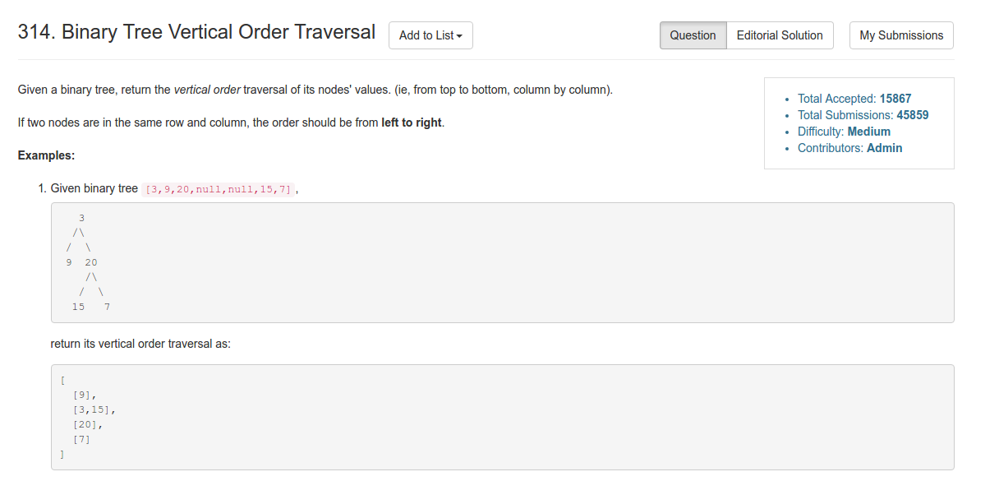
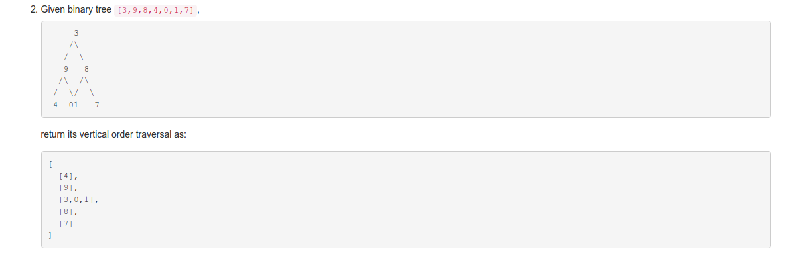
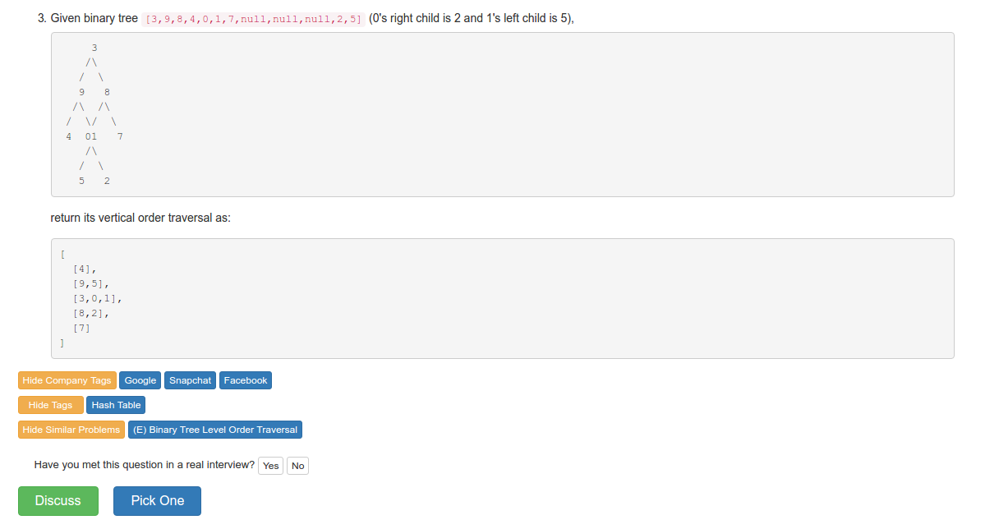

# Problem 314: Binary Tree Vertical Order Traversal

> https://leetcode.com/problems/binary-tree-vertical-order-traversal/

----------




-------------------
##思路
* 这道题看似很难下手，到底该怎么对应没给 vertical 下面的 node 啊。但是看了答案才发现，其实思路很直接：就是如果是左子树，那么他对应的 col 就是 col - 1；右子树就是 col + 1。最后把这些 node 和他对应的 col 存到一个 HashMap 里就可以了。
* 可以用 bfs 来遍历每个 node。用两个 queue 来存储：一个 queue 放 ndoe，另一个 queue 放对应的 col；同时存，同时 poll。
* 如果有左子树， col - 1；右子树，col + 1.

----------------
```java
/**
 * Definition for a binary tree node.
 * public class TreeNode {
 *     int val;
 *     TreeNode left;
 *     TreeNode right;
 *     TreeNode(int x) { val = x; }
 * }
 */
public class Solution {
    public List<List<Integer>> verticalOrder(TreeNode root) {
        List<Integer> path = new ArrayList<Integer>();
        List<List<Integer>> rst = new ArrayList(path);
        
        if (root == null) {
            return rst;
        }
        
        int[] range = new int[] {0, 0};
        findRange(range, root, 0);
        for (int i = range[0]; i <= range[1]; i++) {
            rst.add(new ArrayList<Integer>());
        }
        
        Queue<TreeNode> queue = new LinkedList<TreeNode>();
        Queue<Integer> colQueue = new LinkedList<Integer>();
        queue.add(root);
        colQueue.add(-range[0]);
        
        while (!queue.isEmpty()) {
            TreeNode node = queue.poll();
            int col = colQueue.poll();
            
            rst.get(col).add(node.val);
            
            if (node.left != null) {
                queue.add(node.left);
                colQueue.add(col - 1);
            }
            if (node.right != null) {
                queue.add(node.right);
                colQueue.add(col + 1);
            }
            
        }
         
        return rst;
        
    }
    
    private void findRange(int[] range, TreeNode root, int col) {
        if (root == null) {
            return;
        }
        range[0] = Math.min(range[0], col);
        range[1] = Math.max(range[1], col);
        
        findRange(range, root.left, col - 1);
        findRange(range, root.right, col + 1);
    }
}
```
------
##易错点
1. root 的 col 值
```java
queue.add(root);
colQueue.add(-range[0]);
```
因为我们在求 range 的时候，是以 0 为基准，左边的会一直减去 1,变成负数。这时候，root 的值应该就是与最远处的负数对应的正数，这样最左边的 col 正好是 0。
2. rst 每个位置都建好一个 ArrayList
```java
for (int i = range[0]; i <= range[1]; i++) {
      rst.add(new ArrayList<Integer>());
}
```
这样后面就可以在对应的 col 上添加 node 了
```java
rst.get(col).add(node.val);
```


