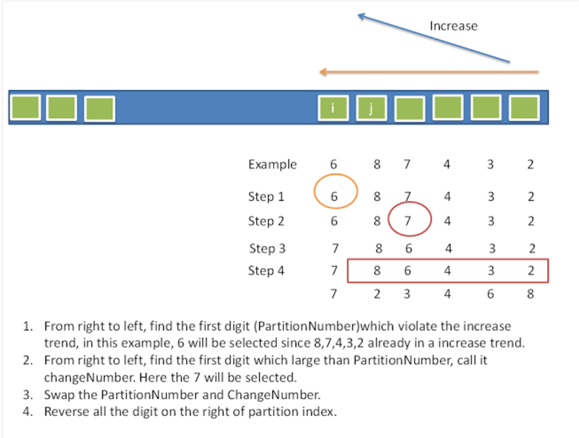

# Problem 31: Next Permutation


> https://leetcode.com/problems/next-permutation/

-------------
##思路


------------
```java
public class Solution {
    public void nextPermutation(int[] nums) {
        if (nums == null || nums.length == 0) {
            return;
        }
        
        int len = nums.length;
        for (int i = len - 2; i >= 0; i--) {
            if (nums[i + 1] > nums[i]) {
                int j;
                for (j = len - 1; j > i; j--) {
                    if (nums[j] > nums[i]) {
                        break;
                    }
                }
            swap(nums, i, j);
            reverse(nums, i + 1, len - 1);
            return;
            }
            
        }
        reverse(nums, 0, len - 1);
    }
    
    private void swap(int[] nums, int i, int j) {
        int temp = nums[i];
        nums[i] = nums[j];
        nums[j] = temp;
    }
    
    private void reverse(int[] nums, int start, int end) {
        for (int i = start, j = end; i < j; i++, j--) {
            swap(nums, i, j);
        }
    }
        
}
```
-----
##易错点

1. 这两个 swap() 和　reverse() 的函数一定要熟练掌握！
2. index 很容易搞错，什么时候是 len - 2，什么时候是 len - 1
3. 如果 nums[i + 1] > nums[i] 发生在中间的时候，立即 swap，reverse；如果一直到退出循环都遇到，那就是发生了形如 “321” 的情况，直接reverse 就好了


