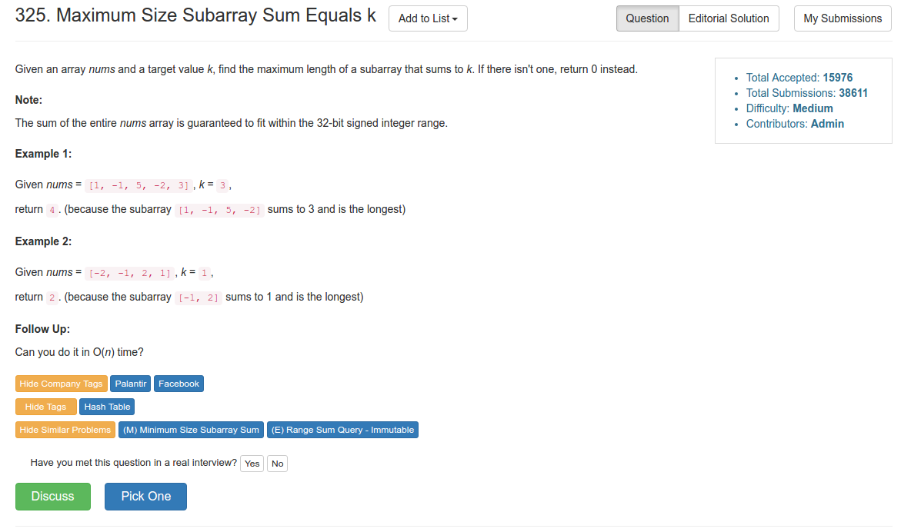

# Problem 325: Maximum Size Subarray Sum Equals k

> https://leetcode.com/problems/maximum-size-subarray-sum-equals-k/

---------


------------------
##思路
* 这道题要求用 O(n) 的时间来解决，也就是说只能扫一遍数组
* 我们可以用一个 HashMap 来存每个位置上的 sum 和 position。这样，在 sum 到 sum + k 之间的这段数就是一段满足条件的 subarray
* 用一个 maxLen 同时来维护最长的 length

-----------
```java
public class Solution {
    public int maxSubArrayLen(int[] nums, int k) {
        if (nums == null || nums.length == 0) {
            return 0;
        }
        
        int sum = 0;
        int maxLen = Integer.MIN_VALUE;
        HashMap<Integer, Integer> map = new HashMap<Integer, Integer>();
        map.put(0, -1);
        for (int i = 0; i < nums.length; i++) {
            sum += nums[i];
            if (!map.containsKey(sum)) {
                map.put(sum, i);
            }
            
            if (map.containsKey(sum - k)) {
                int pos = map.get(sum - k);
                maxLen = Math.max(maxLen, i - pos);
            }
        }
        
        return maxLen == Integer.MIN_VALUE ? 0 : maxLen;
    }
}
```
-----
##易错点
1. 首先把第一个元素放进 map
```java
map.put(0, -1);
```
这样保证的是，当 sum 为 0 的时候，最长的子段是 1.


