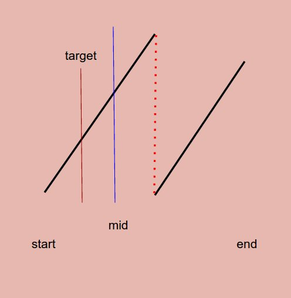

# Problem 33: Search in Rotated Sorted Array


> https://leetcode.com/problems/search-in-rotated-sorted-array/

--------------------------------------
##思路


1. 先判断```nums[start]```和```nums[mid]```的关系，这样可以判断区间内是否经过了gap
2. 然后在一段子区间内，同时满足两个条件才能进行二分法

------------------
```java
public class Solution {
    public int search(int[] nums, int target) {
        if (nums == null || nums.length == 0) {
            return -1;
        }
        
        int start = 0;
        int end = nums.length - 1;
        int mid;
        
        while (start + 1 < end) {
            mid = start + (end - start) / 2;
            if (target == nums[mid]) {
                return mid;
            }
            if (nums[start] < nums[mid]) {
                if(target >= nums[start] && target <= nums[mid]) {
                    end = mid;
                } else {
                    start = mid;
                }
            } else {
                if (target >= nums[mid] && target <= nums[end]) {
                    start = mid;
                } else {
                    end = mid;
                }
            }
        }
        if (target == nums[start]) {
            return start;
        }
        if (target == nums[end]) {
            return end;
        }
        
        return -1;
    }
}
```
-------------------------
##易错点

1. while的循环退出条件
```java
while (start + 1 < end) {}
```
很关键，不能忘。

2. 分清什么时候是进行index的操作，什么时候是比较数组当中的值
很容易错，时刻分清。


