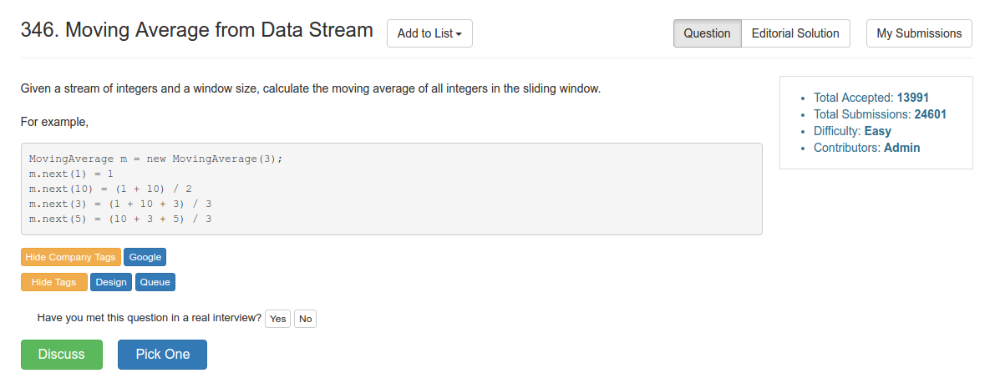

# Problem 346: Moving Average from Data Stream

> https://leetcode.com/problems/moving-average-from-data-stream/

-----------


-------
##思路
* 一个经典的 queue 的题目

---------------
```java
public class MovingAverage {
    Queue<Integer> queue;
    int size;
    int sum;
    
    /** Initialize your data structure here. */
    public MovingAverage(int size) {
        queue = new LinkedList<Integer>();
        this.size = size;
        sum = 0;
    }
    
    public double next(int val) {
        if (queue.size() < size) {
            queue.offer(val);
            sum += val;
        } else {
            int tmp = queue.poll();
            sum -= tmp;
            queue.add(val);
            sum += val;
        }
        
        return (double) sum / queue.size();
    }
}

/**
 * Your MovingAverage object will be instantiated and called as such:
 * MovingAverage obj = new MovingAverage(size);
 * double param_1 = obj.next(val);
 */
```


