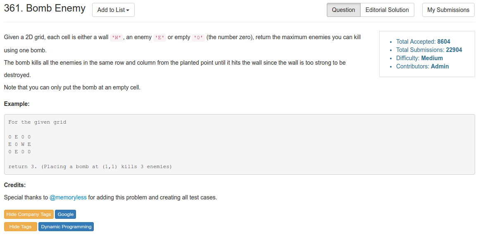

# Problem 361: Bomb Enemy


> https://leetcode.com/problems/bomb-enemy/

----------



--------
##思路
* 这道题用递归的话会非常麻烦，所以可以用 DP 来解决。
* 注意不要搞混 i 和 j，一旦搞混的话很容易就会出现错误并且不好发现。
* 当我们遇到 W 的时候跳过；如果是一个 row 的头，或者本行的前一个元素是 W，那么我们就计算这一行的 E （从砖头以后计算）；col 同理。
* 我们需要体会的一点是，**什么时候需要重新计算 row 和 col，什么时候可以接着用之前的**，这才是关键

----------
##复杂度
* Time  
$$O(mn)$$
* space  (之维持 col[] 从而节约空间)
$$O(n)$$
-------
```java
public class Solution {
    public int maxKilledEnemies(char[][] grid) {
        if (grid == null || grid.length == 0 || grid[0].length == 0) {
            return 0;
        }
        int max = 0;
        int row = 0;
        int[] col = new int[grid[0].length];
        for (int i = 0; i < grid.length; i++) {
            for (int j = 0; j < grid[0].length; j++) {
                if (grid[i][j] == 'W') {
                    continue;
                }
                if (j == 0 || grid[i][j - 1] == 'W') {
                    row = calculateRow(grid, i, j);
                }
                if (i == 0 || grid[i - 1][j] == 'W') {
                    col[j] = calculateCol(grid, i, j);
                }
                if (grid[i][j] == '0') {
                    max = Math.max(max, row + col[j]);
                }
            }
        }
        
        return max;
    }
    
    private int calculateRow(char[][] grid, int i, int j) {
        int count = 0;
        while (j < grid[0].length && grid[i][j] != 'W') {
            if (grid[i][j] == 'E') {
                count++;
            }
            j++;
        }
        
        return count;
    }
    
    private int calculateCol(char[][] grid, int i, int j) {
        int count = 0;
        while (i < grid.length && grid[i][j] != 'W') {
            if (grid[i][j] == 'E') {
                count++;
            }
            i++;
        }
        
        return count;
    }
    
}
```
-----------
##易错点
1. i 和 j 容易搞混。想清楚什么时候计算行，什么时候计算列
2. 计算行（列）的时候，```j++```放在 if 外面，否则死循环
```java
while (j < grid[0].length && grid[i][j] != 'W') {
      if (grid[i][j] == 'E') {
            count++;
      }
      j++;
}
```


