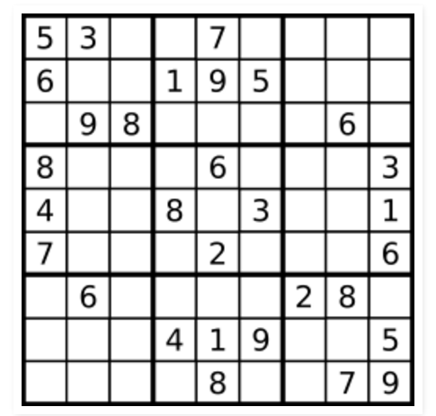

# Problem 36: Valid Sudoku

> https://leetcode.com/problems/valid-sudoku/

------
##思路
* 这道题**不是让判断数独是否有解**，而是判断行，列，sub matrix 里面有没有重复元素
* 关键是对 sub matrix 的元素的 index 进行定位

实际上就是定位这 9 个小 matrix，所以总共有 3 X 3 个小方块。用 i 和 j 来定位这些方块，用 k 来定位每一个点。k / 3 定位某一行；k % 3 来定位某一列。
* 无论是行，列还是小方块，都是 9 个数字，所以我们用一个 visited[] 来记录是否访问过

----------
```java
public class Solution {
    public boolean isValidSudoku(char[][] board) {
        boolean[] visited = new boolean[9];
        
        // row
        for (int i = 0; i < 9; i++) {
            Arrays.fill(visited, false);
            for (int j = 0; j < 9; j++) {
                if (!check(visited, board[i][j])) {
                    return false;
                }
            }
        }
        
        // col
        for (int j = 0; j < 9; j++) {
            Arrays.fill(visited, false);
            for (int i = 0; i < 9; i++) {
                if (!check(visited, board[i][j])) {
                    return false;
                }
            }
        }
        
        // sub matrix
        for (int i = 0; i < 9; i += 3) {
            for (int j = 0; j < 9; j += 3) {
                Arrays.fill(visited, false);
                for (int k = 0; k < 9; k++) {
                    if (!check(visited, board[i + k / 3][j + k % 3])) {
                        return false;
                    }
                }
            }
        }
        
        return true;
    }
    
    private boolean check(boolean[] visited, char digit) {
        if (digit == '.') {
            return true;
        }
        
        int num = digit - '0';
        if (num < 1 || num > 9 || visited[num - 1]) {
            return false;
        }
        
        visited[num - 1] = true;
        return true;
    }

}
```
----
##易错点
1. 实际的 number 和 visited[] 的序号实际上差了一位数
```java
if (num < 1 || num > 9 || visited[num - 1]) {
           return false;
}      
visited[num - 1] = true;
```
2. 每个 boolean 表示的意义不同
visited[] 表示的是是否访问过； check() 表示的是是否是 valid 的行（列，matrix）
3. **char 转 int**
```java
int num = digit - '0';
```
如果减去 '0'，char 自动转为 int


