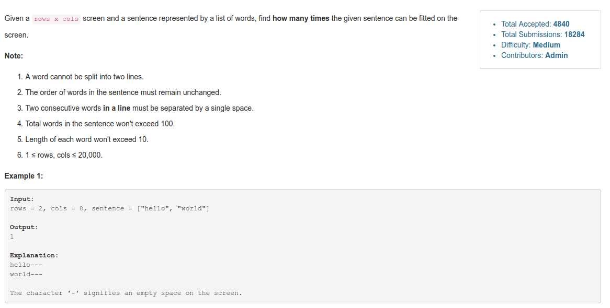
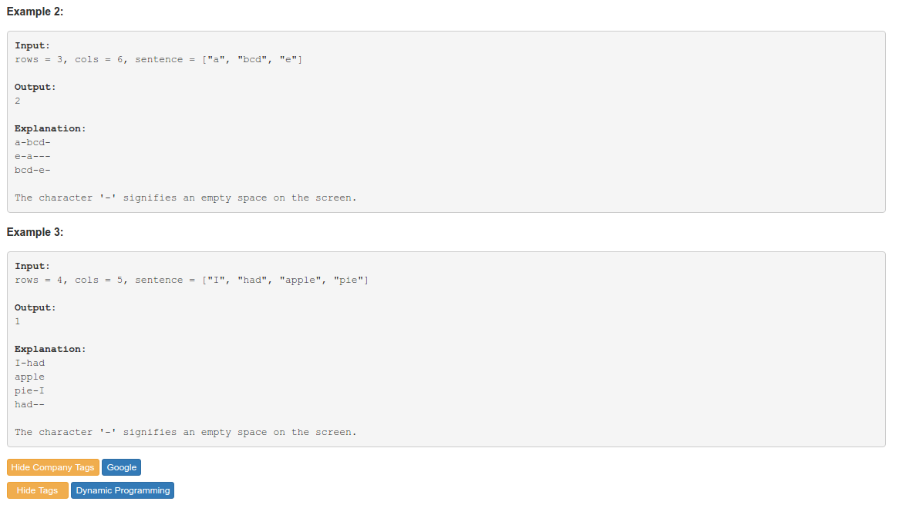
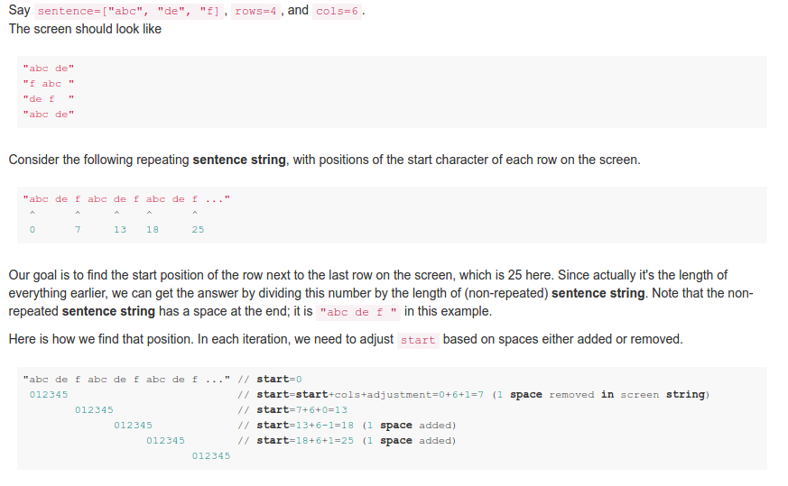

# Problem 418: Sentence Screen Fitting


> https://leetcode.com/problems/sentence-screen-fitting/

----------



-----------
##思路


-------
##复杂度
* Time  
$$O(m + n)$$  
其中 m 是 rows，n 是 cols

-----------
```java
public class Solution {
    public int wordsTyping(String[] sentence, int rows, int cols) {
        String s = String.join(" ", sentence) + " ";
        int len = s.length(), count = 0;
        int[] index = new int[len];
        
        for (int i = 1; i < len; i++) {
            index[i] = s.charAt(i) == ' ' ? 1 : index[i - 1] - 1;
        }
        for (int i = 0; i < rows; i++) {
            count += cols;
            count += index[count % len];
        }
        
        return count / len;
    }
}
```


