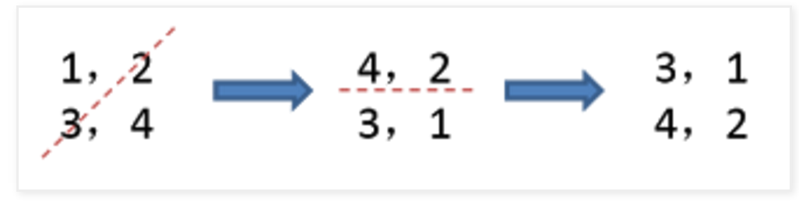

# Problem 48: Rotate Image


> https://leetcode.com/problems/rotate-image/

-----------
##思路


* 首先沿对角线对称变换，再沿 x 做镜面变换
* 所以我们可以知道 ```matrix[i][j]``` 的变换过程：  
列的变换：就是上一个的行（y = x 做对称，相当于把 x，y 对调）；
行的变换：用总的长度 len - 1 减去 之前的列的坐标 (之所以是之前列的坐标不是行的坐标是因为已经做了对角线的对称变换，现在的行就是之前的列)

--------------
```java
public class Solution {
    public void rotate(int[][] matrix) {
        if (matrix == null || matrix.length == 0) {
            return;
        }
        
        int len = matrix.length;
        for (int i = 0; i < len / 2; i++) {
            for (int j = 0; j < (len + 1) / 2; j++) {
                int tmp = matrix[i][j];
                matrix[i][j] = matrix[len - 1 - j][i];
                matrix[len - 1 - j][i] = matrix[len - 1 - i][len - 1 - j];
                matrix[len - 1 - i][len - 1 - j] = matrix[j][len - 1 - i];
                matrix[j][len - 1 - i] = tmp;
            }
        }
    }
}
```
---------------
* 下面更新俩正转，反转的 general 的解法
> https://discuss.leetcode.com/topic/6796/a-common-method-to-rotate-the-image

```
/*
 * clockwise rotate
 * first reverse up to down, then swap the symmetry 
 * 1 2 3     7 8 9     7 4 1
 * 4 5 6  => 4 5 6  => 8 5 2
 * 7 8 9     1 2 3     9 6 3
*/
void rotate(vector<vector<int> > &matrix) {
    reverse(matrix.begin(), matrix.end());
    for (int i = 0; i < matrix.size(); ++i) {
        for (int j = i + 1; j < matrix[i].size(); ++j)
            swap(matrix[i][j], matrix[j][i]);
    }
}

```


```java
public class Solution {
    public void rotate(int[][] matrix) {
        if (matrix == null || matrix.length == 0) {
            return;
        }
        
        for (int i = 0; i < matrix.length / 2; i++) {
            int[] tmp = matrix[i];
            matrix[i] = matrix[matrix.length - 1 - i];
            matrix[matrix.length - 1 - i] = tmp;
        }
        
        for (int i = 0; i < matrix.length; i++) {
            for (int j = i + 1; j < matrix[i].length; j++) {
                int tmp = matrix[i][j];
                matrix[i][j] = matrix[j][i];
                matrix[j][i] = tmp;
            }
        }
    }
}
```
---


```
/*
 * anticlockwise rotate
 * first reverse left to right, then swap the symmetry
 * 1 2 3     3 2 1     3 6 9
 * 4 5 6  => 6 5 4  => 2 5 8
 * 7 8 9     9 8 7     1 4 7
*/
void anti_rotate(vector<vector<int> > &matrix) {
    for (auto vi : matrix) reverse(vi.begin(), vi.end());
    for (int i = 0; i < matrix.size(); ++i) {
        for (int j = i + 1; j < matrix[i].size(); ++j)
            swap(matrix[i][j], matrix[j][i]);
    }
}
```


```java
public class Solution {
    public void rotate(int[][] matrix) {
        if (matrix == null || matrix.length == 0) {
            return;
        }
        
        for (int i = 0; i < matrix.length; i++) {
            for (int j = 0; j < matrix[0].length; j++) {
                int tmp = matrix[i][j];
                matrix[i][j] = matrix[i][matrix[0].length - 1 - j];
                matrix[i][matrix[0].length - 1 - j] = tmp;
            }
        }
        
        for (int i = 0; i < matrix.length; i++) {
            for (int j = i + 1; j < matrix[i].length; j++) {
                int tmp = matrix[i][j];
                matrix[i][j] = matrix[j][i];
                matrix[j][i] = tmp;
            }
        }
    }
}
```


------------
##易错点

1. j 的界限
```java
 for (int j = 0; j < (len + 1) / 2; j++)
```
先记着吧，挺 tricky 的


