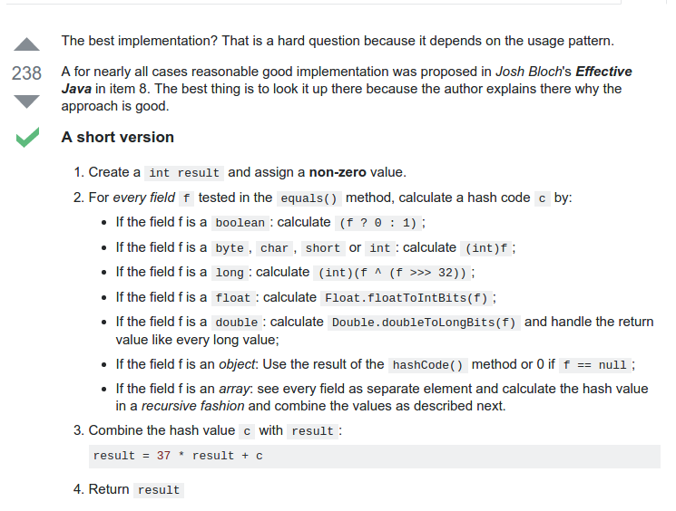

# Problem 49: Group Anagrams


> https://leetcode.com/problems/anagrams/

-------
##思路
* 直观的思路就是，同一类的几个字符串之间，他们只是顺序不同，每一个字母的个数其实是相同的。所以我们可以用一个 26 个字母组成的数组 count 来记录不同的字符串
* 同一类的字符串，给他们一个相同的 hash 值。注意：计算 hash 值的时候，要用质数

-------
```java
/* 
    非最优解法，有额外空间
*/
public class Solution {
    public List<List<String>> groupAnagrams(String[] strs) {
        List<String> path = new ArrayList<String>();
        List<List<String>> rst = new ArrayList<>();
        if (strs == null || strs.length == 0) {
            return rst;
        }
        
        HashMap<String, ArrayList<String>> map = new HashMap<String, ArrayList<String>>();
        for (String s : strs) {
            char[] arr = s.toCharArray();
            Arrays.sort(arr);
            String key = new String(arr);
            if (!map.containsKey(key)) {
                map.put(key, new ArrayList<String>());
            } 
            map.get(key).add(s);
        }
        
        for (String s : map.keySet()) {
            path = new ArrayList<String>();
            path = map.get(s);
            Collections.sort(path);
            rst.add(path);
        }
        
        return rst;
        
    }
}

```

```java
public class Solution {
    public List<List<String>> groupAnagrams(String[] strs) {
        List<String> path = new ArrayList<String>();
        List<List<String>> result = new ArrayList(path);
        HashMap<Integer, ArrayList<String>> map = new HashMap<Integer, ArrayList<String>>();
        
        for (String str : strs) {
            int[] count = new int[26];
    
            for (int i = 0; i < str.length(); i++) {
                count[str.charAt(i) - 'a']++;
            }
            int hash = getHash(count);
            if (!map.containsKey(hash)) {
                map.put(hash, new ArrayList<String>());
            }
            map.get(hash).add(str);
        }
        
        for (ArrayList<String> tmp : map.values()) {
            result.add(tmp);
        }
        
        return result;
    }
    
    private int getHash(int[] count) {
        int hash = 0;
        int a = 378551;
        int b = 63689;
        for (int num : count) {
            hash = a * hash + num;
            a = a * b;
        }
        return hash;
    }
}
```
---
##易错点
1. 计算 hash code
```java
private int getHash(int[] count) {
        int hash = 0;
        int a = 378551;
        int b = 63689;
        for (int num : count) {
            hash = a * hash + num;
            a = a * b;
        }
        return hash;
}
```

2. 记录每个字母出现的次数
```java
for (int i = 0; i < str.length(); i++) {
          count[str.charAt(i) - 'a']++;
}
```
3. 加入 str 到 map
```java
map.get(hash).add(str);
``` 
这里是其实是需要解释一下的：首先 map 的格式是这样的 ```HashMap<Integer, ArrayList<String>>```，key 是 Integer，value 是 ```ArrayList<String>```，所以当 ```map.get(hash)```的时候，得到的其实是一个 ArrayList，再往里面加东西的时候，用 add() 方法

4. 逻辑结构
```java
if (!map.containsKey(hash)) {
       map.put(hash, new ArrayList<String>());
}
map.get(hash).add(str);
``` 
之前用了 if - else 的结构，导致出现错误。这里不是两者取其一的问题，而是先判断有没有这个 key，没有的话先构造一个 key，然后再把字符串加进去。


