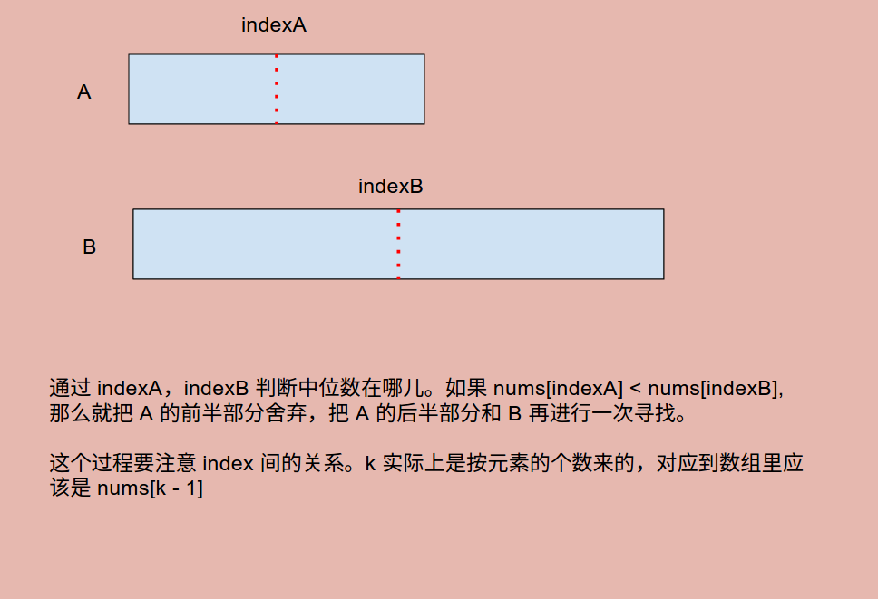

# Problem 4: Median of Two Sorted Arrays


> https://leetcode.com/problems/median-of-two-sorted-arrays/

-----------
##思路
* 非常经典的一道题
* 主要的思路：  
(1)保持A是短的那一个数组，B是长的  
(2)平分k, 一半在A，一半在B （如果A的长度不足K/2,那就partA就指到最后一个）  
(3)如果partA的值 < partB的值，那证明第K个数肯定不会出现在partA之前，递归，把A数组partA之前的砍掉，同理递归砍B数组。  
(4)递归到 m == 0 （短的数组用完了） 就返回 B[k - 1], 或者k == 1（找第一个数）就返回min(A第一个数，B第一个数）



---------
```java
public class Solution {
    public double findMedianSortedArrays(int[] nums1, int[] nums2) {
        int m = nums1.length, n = nums2.length;
        int total = m + n;
        if (total % 2 != 0) {
            return findKth(nums1, 0, m - 1, nums2, 0, n - 1, total / 2 + 1);
        } else {
            double x = findKth(nums1, 0, m - 1, nums2, 0, n - 1, total / 2);
            double y = findKth(nums1, 0, m - 1, nums2, 0, n - 1, total / 2 + 1);
            return (double) (x + y) / 2;
        }
    }
    
    private int findKth(int[] A, int aStart, int aEnd, int[] B, int bStart, int bEnd, int k) {
        int m = aEnd - aStart + 1;
        int n = bEnd - bStart + 1;
        if (m > n) {
            return findKth(B, bStart, bEnd, A, aStart, aEnd, k);
        }
        if (m == 0) {
            return B[k - 1];
        }
        if (k == 1) {
            return Math.min(A[aStart], B[bStart]);
        }
        
        int indexA = Math.min(k / 2, m);
        int indexB = k - indexA;
        if (A[aStart + indexA - 1] < B[bStart + indexB - 1]) {
            return findKth(A, aStart + indexA, aEnd, B, bStart, bEnd, k - indexA);
        } else if (A[aStart + indexA - 1] > B[bStart + indexB - 1]) {
            return findKth(A, aStart, aEnd, B, bStart + indexB, bEnd, k - indexB);
        } else {
            return A[aStart + indexA - 1];
        }
    }
}
```
-----
##易错点
1. k 对应的是个数  
比如：```[0, 1, 2]```，这里求出来的 k = total / 2 + 1 = 2；意思是第 2 个数，但在数组里他是 ```nums[k - 1]```
2. 里面的 index 之间的关系比较容易搞错。


