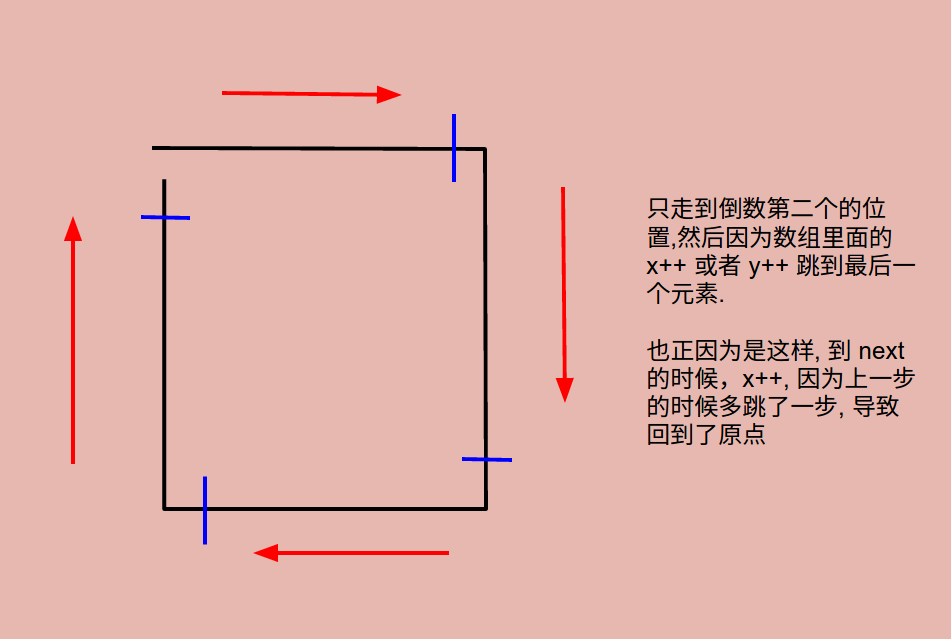

# Problem 54: Spiral Matrix


> https://leetcode.com/problems/spiral-matrix/

--------
##思路

* x,y 控制方向，m, n 控制 boundary

---------------
```java
public class Solution {
    public List<Integer> spiralOrder(int[][] matrix) {
        List<Integer> rst = new ArrayList<Integer>();
        if (matrix == null || matrix.length == 0) {
            return rst;
        }
        
        int m = matrix.length;
        int n = matrix[0].length;
        int x = 0, y = 0;
        
        while (m > 0 && n > 0) {
            if (m == 1) {
                for (int i = 0; i < n; i++) {
                    rst.add(matrix[x][y++]);
                }
                break;
            } else if (n == 1) {
                for (int i = 0; i < m; i++) {
                    rst.add(matrix[x++][y]);
                }
                break;
            }
            
            // top left to right
            for (int i = 0; i < n - 1; i++) {
                rst.add(matrix[x][y++]);
            }
            // to bottom
            for (int i = 0; i < m - 1; i++) {
                rst.add(matrix[x++][y]);
            }
            // to left
            for (int i = 0; i < n - 1; i++) {
                rst.add(matrix[x][y--]);
            }
            // to top
            for (int i = 0; i < m - 1; i++) {
                rst.add(matrix[x--][y]);
            }
            
            // next cycle
            x++;
            y++;
            m -= 2;
            n -= 2;
        }
        
        return rst;
    }
}
```
---
##易错点

1. 进入 next cycle 的时候，x++  
因为上一步的时候，```rst.add(matrix[x--][y]);```，x 多退了一步，现在要退回来。
2. 考虑 m 和 n 为 1 的情况。
3. m 和 n 的 step 是 2, 因为走完一圈以后，左右两边各有一个元素占据，新的 boundary 少了 2


