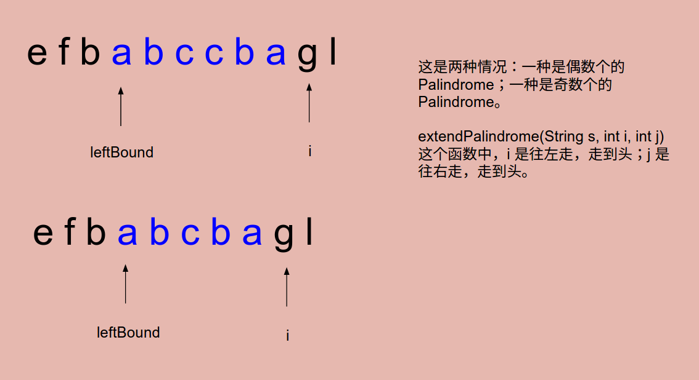
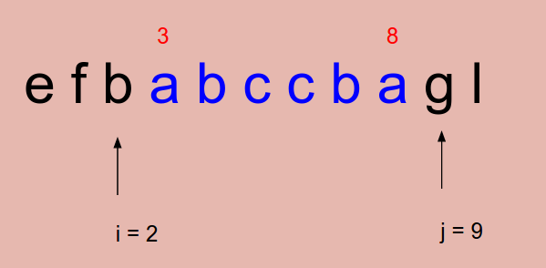

# Problem 5: Longest Palindromic Substring


> https://leetcode.com/problems/longest-palindromic-substring/

-------
##思路

* **中心回探法：** 
```
1)可以是一个字符
2)或者是两个字符的间隙，
3)比如串abc,中心可以是a,b,c,或者是ab的间隙，bc的间隙）往两边同时进行扫描，直到不是回文串为止。
4)假设字符串的长度为n,那么中心的个数为2*n-1(字符作为中心有n个，间隙有n-1个）。
5)对于每个中心往两边扫描的复杂度为O(n),所以时间复杂度为O((2*n-1)*n)=O(n^2),空间复杂度为O(1)
```
----
```java
public class Solution {
    private int leftBound, max;
    
    public String longestPalindrome(String s) {
        if (s == null || s.length() < 2) {
            return s;
        }
        
        for (int i = 0; i < s.length(); i++) {
            extendPalindrome(s, i, i);
            extendPalindrome(s, i, i + 1);
        }
        
        return s.substring(leftBound, leftBound + max);
    }
    
    private void extendPalindrome(String s, int i, int j) {
        while (i >= 0 && j <= s.length() - 1 && s.charAt(i) == s.charAt(j)) {
            i--;
            j++;
        }
        if (max < j - i -1) {
            leftBound = i + 1;
            max = j - i - 1;
        }
    }
}
```
----
##易错点

1. substring(a, b) 左闭右开： **[a, b)**，这也解释了在 extendPalindrome() 函数中，leftBound = i + 1;
2. 因为有奇数个和偶数个的 Palindrome，所以循环的时候有两次调用方程
```java
for (int i = 0; i < s.length(); i++) {
         extendPalindrome(s, i, i);
         extendPalindrome(s, i, i + 1);
}
```
3. while 循环完之后，**i 和 j 是在循环范围两边的！**
```java
 while (i >= 0 && j <= s.length() - 1 && s.charAt(i) == s.charAt(j)) {
         i--;
         j++;
}
```

循环结束之后，应该退回来，两个定位的点应该是 (i + 1), (j - 1)
4. 这里的 max 指的是回文串的长度，max = （j - 1）- (i + 1) + 1 = j - i - 1


