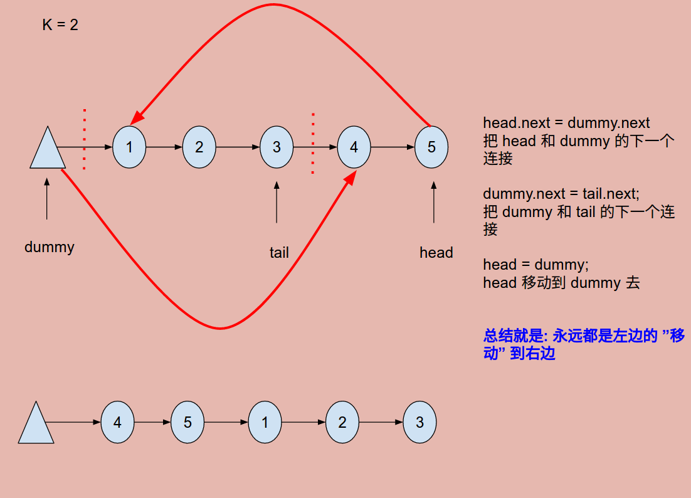

# Problem 61: Rotate List


> https://leetcode.com/problems/rotate-list/

------
##思路
* 这道题看着简单，实际上有很多值得思考的地方
* 第一就是下面的这个解法只是单纯地移动指针，不单独再建一个 ListNode 存后面的结点，这样做的好处是不耗费额外空间。


----------
```java
/**
 * Definition for singly-linked list.
 * public class ListNode {
 *     int val;
 *     ListNode next;
 *     ListNode(int x) { val = x; }
 * }
 */
public class Solution {
    public ListNode rotateRight(ListNode head, int k) {
        if (head == null) {
            return head;
        }
        int len = getLength(head);
        k = k % len;
        
        ListNode dummy = new ListNode(0);
        dummy.next = head;
        head = dummy;
        for (int i = 0; i < k; i++) {
            head = head.next;
        }
        
        ListNode tail = dummy;
        while (head.next != null) {
            tail = tail.next;
            head = head.next;
        }
        
        head.next = dummy.next;
        dummy.next = tail.next;
        tail.next = null;
        
        return dummy.next;
    }
    
    private int getLength(ListNode head) {
        int len = 0;
        while (head != null) {
            head = head.next;
            len++;
        }
        return len;
    }
}
```
----
##易错点

1. check head 是否为空，否则 lengh 为 0，不能作为除数
2. **考虑到 k 有可能比 head 的长度大的问题！**
3. 指针的移动很重要，一定要学会！注意看上边的图


