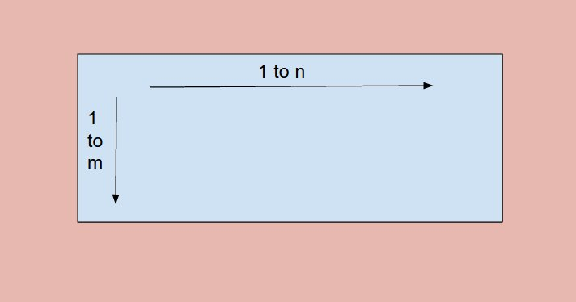

# Problem 62: Unique Paths


> https://leetcode.com/problems/unique-paths/

------------------------------------
##思路
典型的 matrix 型 DP 问题，倒推比较容易想， 最后一步的时候，到达它只有两种可能：左边或者上边。

---------------------------------
```java
public class Solution {
    public int uniquePaths(int m, int n) {
        //state
        int[][] f = new int[m][n];
        
        //initiate
        for (int i = 0; i < m; i++) {
            f[i][0] = 1;
        }
        for (int i = 0; i < n; i++) {
            f[0][i] = 1;
        }
        
        //function
        for (int i = 1; i < m; i++) {
            for (int j = 1; j < n; j++) {
                f[i][j] = f[i - 1][j] + f[i][j - 1];
            }
        }
        //answer
        return f[m - 1][n - 1];
    }
}
```
-------------------------
##易错点

1. 对于这种问题，脚标很容易写错。所以提前在纸上把表格画出来比较好。
2. 由于```f[0][i]```和```f[i][0]```，也就是第一橫行和第一纵列只有一种可能：1，所以这就是我们的初始化。
3. **如何填表格** 以下两种两层循环是不一样的。
   ```java
   for (int i = 1; i < m; i++) {
        for (int j = 1; j < n; j++) {
             f[i][j] = f[i - 1][j] + f[i][j - 1];
        }
   }
   ```
   ```java
   for (int i = 1; i < n; i++) {
        for (int j = 1; j < m; j++) {
             f[i][j] = f[i - 1][j] + f[i][j - 1];
        }
   }
   ```
   **理解的关键就是，内层循环是先开始的，也就是从1到n，然后外层循环从1到m**
   


